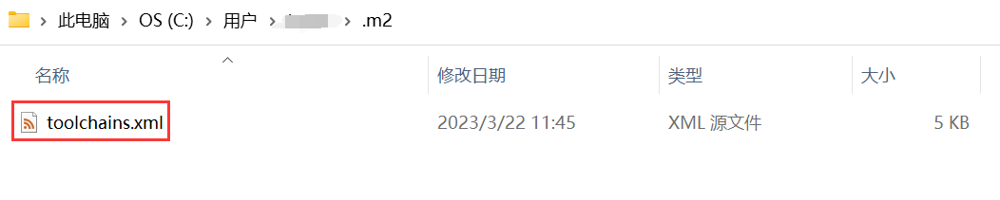
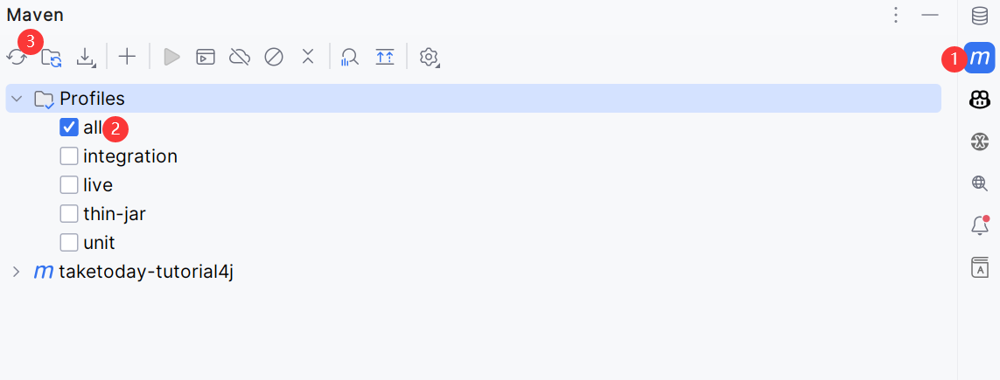

Taketoday Tutorial4j
==============

[](https://img.shields.io/badge/java-17-blue)

[](https://sonarcloud.io/summary/new_code?id=tu-yucheng_taketoday-tutorial4j)
[](https://sonarcloud.io/dashboard?id=tu-yucheng_taketoday-tutorial4j)
[](https://sonarcloud.io/project/overview?id=tu-yucheng_taketoday-tutorial4j)
[](https://sonarcloud.io/summary/new_code?id=tu-yucheng_taketoday-tutorial4j)
[](#contributors)

这个项目是**一个小型和重点教程的集合**，每个教程都涵盖了Java生态系统中一个明确定义的开发领域。当然，其中一个重点在于Spring框架、Spring Data、Spring Boot、Spring Cloud和Spring Security。除了Spring之外，这里的模块还涵盖了Java的许多方面。

**项目博客**：[tu-yucheng.github.io](https://tu-yucheng.github.io/)。

## 多版本JDK构建

就目前而言，大多数模块都是基于JDK 21(JAVA_HOME)才能正确构建和运行。此外，还有一些模块基于JDK 8，我们通过Maven工具链来保证这些模块能够使用单独的JDK构建。

首先，你需要同时下载这些版本的JDK。然后配置Maven工具链，在你用户目录下的.m2文件夹中创建一个toolchains.xml文件：



在该文件中添加以下内容(务必将每个工具链的<jdkHome\>指向你本地该JDK版本的位置)：

```xml
<?xml version="1.0" encoding="UTF-8"?>
<toolchains xmlns="http://maven.apache.org/TOOLCHAINS/1.1.0" xmlns:xsi="http://www.w3.org/2001/XMLSchema-instance"
            xsi:schemaLocation="http://maven.apache.org/TOOLCHAINS/1.1.0 http://maven.apache.org/xsd/toolchains-1.1.0.xsd">
    <toolchain>
        <type>jdk</type>
        <provides>
            <version>8</version>
            <vendor>adopt</vendor>
        </provides>
        <configuration>
            <jdkHome>D:\\xxx\\jdk-8</jdkHome>
        </configuration>
    </toolchain>
    <toolchain>
        <type>jdk</type>
        <provides>
            <version>21</version>
            <vendor>adopt</vendor>
        </provides>
        <configuration>
            <jdkHome>D:\\xxx\\jdk-21.0.1</jdkHome>
        </configuration>
    </toolchain>
</toolchains>
```

## Maven Profile

我们使用Maven profile来隔离各种测试(单元测试、集成测试、实时测试...)的执行，不同类型的测试类名必须以指定后缀结尾：

| Profile     | 启用的测试类型                     |
|-------------|-----------------------------|
| unit        | *UnitTest                   |
| integration | *IntegrationTest            |
| all         | *IntegrationTest、\*UnitTest |
| live        | *LiveTest                   |
| parents     |         None                    |

> **实时(live)测试是指需要与外部系统进行交互的测试，例如数据库、消息代理、文件系统等**。

## 构建项目

不需要经常一次构建整个仓库，因为我们通常关注特定的模块。

但是，如果我们想在仅启用单元测试的情况下构建整个仓库，我们可以从仓库的根目录调用以下命令：

`mvn clean install -Punit`

或者，如果我们想在启用集成测试的情况下构建整个仓库，我们可以执行以下操作：

`mvn clean install -Pintegration`

## 构建单个模块

要构建特定模块，请在模块目录中运行命令：`mvn clean install`。

你的模块可能是父模块的一部分，例如`parent-boot-2`，`parent-spring-5`等，然后你需要先构建父模块，这样才能构建你的模块。我们创建了一个`parents` profile，你可以使用它来构建父模块，只需按以下方式运行profile：`mvn clean install -Pparents`。

## 从仓库的根目录构建模块

要从仓库的根目录构建特定模块，请在根目录中运行命令：`mvn clean install --pl ddd,annotations -Punit`。

这里的ddd和annotations是我们要构建的模块，unit是要执行的测试类型的Maven profile。

## 运行Spring Boot模块

要运行Spring Boot模块，请在模块目录中运行命令：

`mvn spring-boot:run`

## 导入到IDE

该仓库包含大量模块，当你使用单个模块时，无需导入所有模块(或构建所有模块) - 你只需在Eclipse或IntelliJ中导入该特定模块即可。

当你将项目导入到Intellij IDEA中时，默认不会加载任何子模块。你需要在IDE中转到Maven -> Profiles，然后选择你想要构建的子模块所属的profile，最后刷新等待IDE索引构建完成：



## 运行测试

模块中的命令`mvn clean install`将运行该模块中的单元测试。对于Spring模块，这也将运行`SpringContextTest`(如果存在)。

要同时运行单元和集成测试，请使用以下命令：

`mvn clean install -Pall`

## 贡献人员

<!-- ALL-CONTRIBUTORS-LIST:START - Do not remove or modify this section -->
<!-- prettier-ignore-start -->
<!-- markdownlint-disable -->
<table>
  <tr>
    <td align="center"><a href="https://github.com/tu-yucheng"><br /><sub><b>tuyucheng</b></sub></a><br /><a href="#projectManagement-tuyucheng" title="Project Management">📆</a> <a href="#maintenance-tuyucheng" title="Maintenance">🚧</a> <a href="#content-tuyucheng" title="Content">🖋</a></td>
    <td align="center"><a href="https://github.com/take-today"><br /><sub><b>taketoday</b></sub></a><br /><a href="#content-taketoday" title="Content">🖋</a></td>
  </tr>
</table>