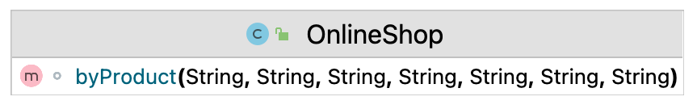
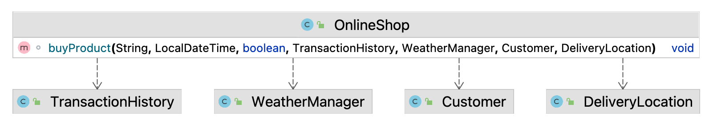
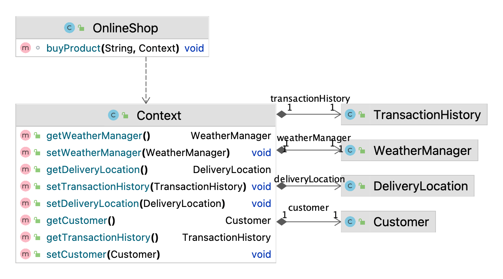

## 1. 概述

在本教程中，我们将讨论利用上下文概念的模式。这些模式有多种解释，因为它不是[GoF](https://en.wikipedia.org/wiki/Design_Patterns)经典模式的一部分。

## 2. 封装上下文

[这个版本](https://accu.org/journals/overload/12/63/kelly_246/)的上下文相关模式解决了两个主要问题：参数数量和统一接口。

### 2.1 减少参数数量

此版本的一个用例是减少传递给方法的参数数量。假设我们要购买一件产品，但我们需要提供有关客户、交货、付款方式等信息：

封装上下文不适合这种情况。我们应该使用[Parameter Object](http://principles-wiki.net/patterns:parameter_object)或[Introduce Parameter Object](https://refactoring.com/catalog/introduceParameterObject.html)，它们与在容器内组织参数的想法相同。使用这些模式分组的元素通常彼此密切相关：

请注意，引入参数对象是一种重构模式，用作一个步骤而不是最终目标。

封装上下文可以用来解决参数不相关的问题：

应用程序域中没有合适的对象来对这些参数进行分组。这就是为什么一些抽象容器在这种情况下很有吸引力：

我们可以识别这种方法，因为上下文组件彼此之间几乎没有关系。此解决方案可能会提供有益的结果，但此模式的某些方面使其变得脆弱，并可能将Context变成[Blob](https://sourcemaking.com/antipatterns/the-blob)。

### 2.2 统一接口

另一个描述的用例试图在方法之间实现统一的接口。假设我们想将我们的OnlineShop类拆分为一个接口下的三个子类。此外，我们希望在单独的实现中分发这些方法：

当所有组件都隐藏在Context中时，实现这一点要容易得多。我们需要做的就是提供传递上下文的接口：

以这种方式使用 Encapsulate Context继承了[Service Locator](https://www.baeldung.com/java-service-locator-pattern)的[所有问题](https://www.baeldung.com/cs/dependency-injection-vs-service-locator)。同时，这个问题不应该像前一个案例那样由参数对象来解决。我们应该重新考虑我们的设计并质疑为同一界面坚持不同方法的想法。

### 2.3. 用例

虽然此模式在某些情况下很有用，并且可能有助于更轻松地理解代码，但 Encapsulate Context 很脆弱，需要深思熟虑的方法。它可以很好地分离对象所需的数据和整个应用程序共享的数据。但是，很容易突破这条线并实施 Blob。

此外，将数据隐藏在容器中会降低代码的可读性和可读性。应用程序的一部分看似无关的更改可能会导致另一部分出现问题。

测试是可能的，但通常需要检查源代码。使用这种模式，接口不会提供足够的信息来说明在测试对象中使用了哪些组件。同时，测试也存在先前的问题：应用程序的一部分发生变化可能会破坏另一部分的测试。

## 3.上下文对象

上下文对象旨在提供一种[协议不可知的](http://www.corej2eepatterns.com/Patterns2ndEd/ContextObject.htm)方式来与全局或上下文数据进行交互。这是保护应用程序不依赖实现细节并使其更加灵活的合理方法：

此实现使用应用程序的单个部分作为 ContextObject 的源并且非常接近[Adapter Pattern](https://www.baeldung.com/java-adapter-pattern)或[Facade Pattern](https://www.baeldung.com/java-facade-pattern)。这是使应用程序更加灵活并保护它免受协议本身的任何更改影响的极好方法。

## 4.上下文模式

这种[方法是由](https://www.dre.vanderbilt.edu/~schmidt/PDF/Context-Object-Pattern.pdf)[Douglas C. Schmidt](https://en.wikipedia.org/wiki/Douglas_C._Schmidt)提出的。我们以一个三层的应用为例：

### 4.1. 通过层传递信息

这些层的主要问题是第三层依赖于第一层中使用的对象C。同时，第二层不需要它。让我们通过简单地将C传递到第二层来解决这个问题：

最后一层需要第一层接收到的信息，这突出了层与层之间传递依赖的问题。

请注意，原始模式的目的不是消除依赖关系或降低依赖关系的透明度。它解决的问题更为复杂：性能改进、简化应用程序的数据管理以及允许中间件应用程序具有更大的灵活性。因此，它在特定环境中使用。在这里，我们将讨论这种方法在更典型的应用程序中存在的问题。

### 4.2. 语境

上下文模式的中心前提是每个应用层不仅依赖于直接的邻居。这个想法是创建一个上下文并允许每个层访问和更改它。我们可以通过层传递Context或使其成为全局的：

这种方法消除了层之间的编译时依赖性，使更改和重构更加容易。但是，将信息隐藏在Context中并不能解决传递依赖关系并使它们不可见。同时，它可能会提高应用程序的性能，因为传递的参数更少，并且还允许更轻松的缓存。

### 4.3. 邮票联轴器

不利的一面是，上下文绑定了不相关的对象，因为它们依赖于它。这被称为[邮票耦合](https://wiki.c2.com/?StampCoupling)。在这种情况下，它有一点抽象。用外行的话来说，Stamp Coupling 是假设所有使用Context 的类都是相关的，这对某些人来说可能是正确的，对其他人来说可能是错误的。这样，上下文类似于服务定位器并且具有类似的不利影响。

使用Context来提高性能或满足特定要求可能是一种合理且快速的解决方案。当最低层依赖于直接邻居之外创建的信息时，它可能会有所帮助。但是，从长远来看，它可能会对代码库产生非常不利的影响。此外，这可能表明图层的设计需要改进。

这种方法存在使类和层之间的关系过于不透明和脆弱的风险。上下文元素中看似无关的更改可能会导致使用这些值的不同层出现问题。通常这些问题只在运行时才会暴露出来。因此，我们应该注意Context的设计并谨慎对待它，因为它可能会影响应用程序的所有层。

### 4.4. 承担额外责任

除了前面描述的问题之外，上下文可能会膨胀，因为它是添加依赖项的完美位置。当一切都可以从Context神奇地获得时，很容易不考虑架构或设计。

还有就是Context可以开始扮演[Observer的](https://www.baeldung.com/java-observer-pattern)角色，承担起沟通的责任，这并不是它的初衷。但是，由于Context可以访问所有层和组件，因此可以这样使用。

这种模式的所有问题都来自于它没有明确的界限，开发人员可以滥用它。总的来说，它只有作为紧急问题的快速解决方案、作为重构的一个步骤，或者在某些具有明确定义的 Context 职责的特定情况下才有意义。

## 5.总结

在本文中，我们讨论了几种利用上下文概念的模式。应谨慎使用这些模式的几个用例。通常，这些模式适用于具有非常具体要求的应用程序。然而，这一事实并不能消除它们的缺点。在大多数情况下，应该完全避免它们，因为它们可能会使代码库变得脆弱并且代码更难遵循。