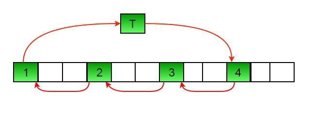

## 1. 问题描述

编写一个方法rotate(arr[], d, n)，将大小为n的数组arr[]旋转d个元素。


例如，将上述数组旋转2以后生成的数组为：


## 2. 使用临时数组

### 2.1 算法实现

```
输入：arr[] = [1, 2, 3, 4, 5, 6, 7], d = 2, n =7

1) 将前d个元素存储在临时数组中
   temp[] = [1, 2]
2) 移动arr[]的其余部分
   arr[] = [3, 4, 5, 6, 7, 6, 7]
3) 存储回前d个元素
   arr[] = [3, 4, 5, 6, 7, 1, 2]
```

以下是上述方法的具体实现：

```java
public class ArrayRotation {

  public static int[] rotateUsingTempArray(int[] arr, int n, int d) {
    int[] temp = new int[d];
    for (int i = 0; i < d; i++)
      temp[i] = arr[i];
    for (int i = 0; i < n - d; i++)
      arr[i] = arr[i + d];
    for (int i = 0; i < d; i++)
      arr[n - d + i] = temp[i];
    return arr;
  }
}
```

### 2.2 复杂度分析

时间复杂度：O(n)

辅助空间：O(n)

## 3. 逐个旋转

```
leftRotate(arr[], d, n)
start
  For i = 0 to i < d
    将arr[]的所有元素左旋1
end
```

要旋转1次，将arr[0]存储在临时变量temp中，将arr[1]移动到arr[0]，将arr[2]移动到arr[1]...最后将temp移动到arr[n-1]。

我们使用相同的案例arr[]=[1，2，3，4，5，6，7]，d=2，将arr[]旋转2次。

我们在第一次旋转后得到[2，3，4，5，6，7，1]，在第二次旋转后得到[3，4，5，6，7，1，2]。

以下为上述方法的具体实现：

```java
public class ArrayRotation {

  public static int[] rotateOneByOne(int[] arr, int n, int d) {
    for (int i = 0; i < d; i++) {
      int temp = arr[0];
      for (int j = 1; j < n; j++)
        arr[j - 1] = arr[j];
      arr[n - 1] = temp;
    }
    return arr;
  }
}
```

## 4. 杂耍算法

### 4.1 算法思想

这是方法2的扩展。不是一个一个移动，而是将数组划分为不同的集合。

其中集合数等于n和d的GCD，并在集合内移动元素。

如果GCD为1，如上述示例数组(n = 7和d = 2)，则元素将仅在一个集合内移动，我们只需从temp=arr[0]开始，并不断将arr[I+d]移动到arr[I]，最终将temp存储在正确的位置。
以下是n = 12和d = 3的示例。GCD为3

```
设数组为{1, 2, 3, 4, 5, 6, 7, 8, 9, 10, 11, 12}

a) 元素首先在第一组中移动---(见下图)
```



```
在此步骤之后arr[]为 --> {4, 2, 3, 7, 5, 6, 10, 8, 9, 1, 11, 12}

b) 然后在第二组中移动
在此步骤之后arr[]为 --> {4, 5, 3, 7, 8, 6, 10, 11, 9, 1, 2, 12}

c) 最后在第三组中移动。
在此步骤之后arr[]为 --> {4, 5, 6, 7, 8, 9, 10, 11, 12, 1, 2, 3}
```

### 4.2 算法实现

以下是上述方法的具体实现：

```java
public class ArrayRotation {

  public static int[] rotatiteUsingJuggling(int[] arr, int n, int d) {
    d = d % n;
    int i, j, k, temp;
    int gcd = gcd(d, n);
    for (i = 0; i < gcd; i++) {
      temp = arr[i];
      j = i;
      while (true) {
        k = j + d;
        if (k >= n)
          k = k - n;
        if (k == i)
          break;
        arr[j] = arr[k];
        j = k;
      }
      arr[j] = temp;
    }
    return arr;
  }

  private static int gcd(int a, int b) {
    if (b == 0)
      return a;
    else return gcd(b, a % b);
  }
}
```

### 4.3 复杂度分析

时间复杂度：O(n)

辅助空间：O(1)