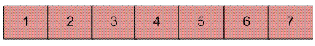
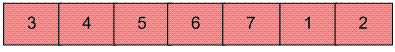

## 1. 问题描述

编写一个函数rotate(arr[], d, n)，将大小为n的数组arr[]旋转d个元素。

示例：

```
输入: arr[] = [1, 2, 3, 4, 5, 6, 7]  d = 2
输出: arr[] = [3, 4, 5, 6, 7, 1, 2]
```

设arr[]中包含的元素为：



例如，如果用户提供一个输入数组，其中数组应旋转2个位置，则生成的数组为：



在之前的文章中已经讨论过三种实现方法。

## 2. 反转算法思想

算法：

```
rotate(arr[], d, n)
  reverse(arr[], 1, d) ;
  reverse(arr[], d + 1, n);
  reverse(arr[], 1, n);
```

设AB是输入数组的两部分，其中A = arr[0...d-1]，B = arr[d...n-1]。该算法的主要思想是：

+ 将A反转得到ArB，其中Ar是A反转之后的数组。
+ 将B反转得到ArBr，其中Br是B反转之后的数组。
+ 全部反转以获得(ArBr)r=BA。

例子：

```
设数组为 arr[] = [1, 2, 3, 4, 5, 6, 7], d = 2, n = 7

A = [1, 2]
B = [3, 4, 5, 6, 7] 

反转A, 我们得到ArB = [2, 1, 3, 4, 5, 6, 7]
反转B, 我们得到ArBr = [2, 1, 7, 6, 5, 4, 3]
全部反转, 我们得到(ArBr)r = [3, 4, 5, 6, 7, 1, 2]
```

## 3. 算法实现

以下是上述方法的具体实现：

```java
public class ArrayRotation {

  public static void rotateUsingReversal(int[] arr, int d) {
    if (d == 0)
      return;
    int n = arr.length;
    d = d % n;
    reverseArray(arr, 0, d - 1);
    reverseArray(arr, d, n - 1);
    reverseArray(arr, 0, n - 1);
  }

  private static void reverseArray(int[] arr, int start, int end) {
    int temp;
    while (start < end) {
      temp = arr[start];
      arr[start] = arr[end];
      arr[end] = temp;
      start++;
      end--;
    }
  }
}
```

## 4. 复杂度分析

该算法时间复杂度为：O(n)

辅助空间：O(1)