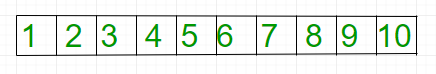
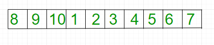

## 1. 问题描述

给定一个数组，右旋k个元素。



右旋三次后：



示例：

```
输入: arr[] = {1, 2, 3, 4, 5, 6, 7, 8, 9, 10}
      k = 3
输出: {8, 9, 10, 1, 2, 3, 4, 5, 6, 7}

输入: arr[] = {121, 232, 33, 43 ,5}
      k = 2
输出: {43, 5, 121, 232, 33,}
```

在下面的解决方案中，假设k小于或等于n。我们可以通过执行k = k % n轻松修改解决方案以处理更大的k值。

## 2. 算法实现

```
rotate(arr[], d, n)
  reverse(arr[], 0, n-1) ;
  reverse(arr[], 0, d-1);
  reverse(arr[], d, n-1);
```

以下是上述算法的具体实现：

```java
public class ArrayRightRotation {

  public static void rightRotate(int[] arr, int n, int d) {
    d = d % n;
    reverse(arr, 0, n - 1);
    reverse(arr, 0, d - 1);
    reverse(arr, d, n - 1);
  }

  public static void reverse(int[] arr, int start, int end) {
    int temp;
    while (start < end) {
      temp = arr[start];
      arr[start] = arr[end];
      arr[end] = temp;
      start++;
      end--;
    }
  }
}
```

时间复杂度：O(n)

空间复杂度：O(1)