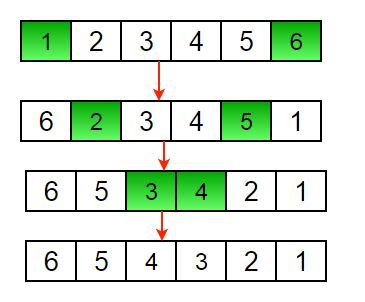
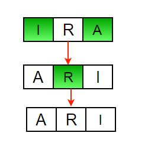

## 1. 问题描述

给定一个数组(或字符串)，目标是反转数组/字符串。

示例：

```
输入: arr[] = {1, 2, 3}
输出: arr[] = {3, 2, 1}

输入: arr[] = {4, 5, 1, 2}
输出: arr[] = {2, 1, 5, 4}
```

## 2. 迭代法

1. 将start和end索引分别初始化为0和n-1。
2. 在循环中，将arr[start]与arr[end]交换，并更改start和end，令start = start +1, end = end – 1。



另一个反转字符串的示例：



以下是上述方法的具体实现：

```java
public class ReverseArray {

  public static void reverseArray(int[] arr, int start, int end) {
    while (start < end) {
      int temp = arr[start];
      arr[start] = arr[end];
      arr[end] = temp;
      start++;
      end--;
    }
  }
}
```

时间复杂度：O(n)

## 3. 递归实现

递归方式：

1. 将start和end索引分别初始化为0和n-1。
2. 将arr[start]与arr[end]交换。
3. 对数组的其余部分递归调用。

以下是上述方法的具体实现：

```java
public class ReverseArray {

  public static void reverseArrayRecursive(int[] arr, int start, int end) {
    if (start >= end)
      return;
    int temp = arr[start];
    arr[start] = arr[end];
    arr[end] = temp;
    reverseArrayRecursive(arr, start + 1, end - 1);
  }
}
```

时间复杂度：O(n)