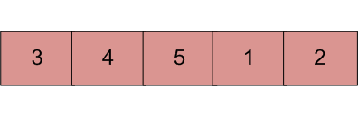

## 1. 问题描述

通过二分搜索，可以在O(log n)时间内找到排序数组中的元素。但是假设我们在你事先不知道的某个轴(pivot)上旋转一个升序排序的数组。
因此，例如[1, 2, 3, 4, 5] 可能会变成[3, 4, 5, 1, 2]。设计一种方法来在O(log n)时间内找到旋转后数组中的元素。



示例：

```
输入: arr[] = {5, 6, 7, 8, 9, 10, 1, 2, 3}; key = 3
输出: 8

输出: arr[] = {5, 6, 7, 8, 9, 10, 1, 2, 3}; key = 30
输出: -1

输入: arr[] = {30, 40, 50, 10, 20} key = 10
输出: 3
```

本文提供的所有解决方案都假设数组中的所有元素都是不同的。

## 2. 算法实现

基本解决方案：

1. 其思想是找到轴(pivot)点，根据pivot将数组分为两个子数组并执行二分搜索。
2. 寻找pivot的主要思想是--对于一个排序(按递增顺序)和旋转后的数组，枢轴元素是唯一一个大于它下一个元素的元素。
3. 使用上面的思路和二分查找可以找到pivot。
4. 找到pivot后，将数组划分为两个子数组。
5. 现在两个子数组都是已排序的，因此可以使用二分搜索来搜索元素。

```
输入 : arr[] = {3, 4, 5, 1, 2}
搜索元素1

1) 找出pivot并将数组分为两个子数组。(pivot = 2)
2) 现在为两个子数组之一调用二分搜索。
   (a) 如果搜索的元素大于第0个元素，则在左数组中搜索。
   (b) 否则在右数组中搜索。
       (因为1 < arr[0] = 3，因此在右数组中搜索)
3) 如果在所选子数组中找到元素，则返回索引，否则返回-1。
```

以下是上述方法的具体实现：

```java
public class PivotBinarySearch {

  public static int pivotBinarySearch(int[] arr, int n, int key) {
    int pivot = findPivot(arr, 0, n - 1);
    if (pivot == -1) // 如果没有找到pivot，表示数组没有旋转
      return binarySearch(arr, 0, n - 1, key);
    // 如果我们找到了一个pivot，那么首先将key与pivot所在元素进行比较
    if (arr[pivot] == key)
      return pivot;
    // 或者在pivot两边的子数组中搜索
    if (key >= arr[0])
      return binarySearch(arr, 0, pivot - 1, key);
    return binarySearch(arr, pivot + 1, n - 1, key);
  }

  private static int binarySearch(int[] arr, int low, int high, int key) {
    if (low > high)
      return -1;
    int mid = (low + high) / 2;
    if (key == arr[mid])
      return mid;
    if (key < arr[mid])
      return binarySearch(arr, low, mid - 1, key);
    return binarySearch(arr, mid + 1, high, key);
  }

  private static int findPivot(int[] arr, int low, int high) {
    if (high < low)
      return -1;
    if (high == low)
      return low;
    int mid = (low + high) / 2;
    if (mid < high && arr[mid] > arr[mid + 1])
      return mid;
    if (mid > low && arr[mid] < arr[mid - 1])
      return mid - 1;
    if (arr[low] >= arr[mid])
      return findPivot(arr, low, mid - 1);
    return findPivot(arr, mid + 1, high);
  }
}
```

复杂度分析：

+ 时间复杂度：O(log n)。二分搜索需要进行log n次比较才能找到元素。所以时间复杂度是O(log n)。
+ 空间复杂度：O(1)，不需要额外的空间。

## 3. 改进算法

结果可以在一次二分搜索中找到，而不是两次或多次二分搜索。需要修改二分搜索以执行搜索。这个想法是创建一个递归函数，将l和r作为输入范围和key。

```
1) 找到中间点 mid = (l + h) / 2
2) If 搜索的key位于中点，返回mid。
3) Else If arr[l...mid]已排序
   a) If 要搜索的key位于arr[l]到[mid]范围内，重复arr[l...mid]。
   b) Else 重复arr[mid+1...h]
4) Else (arr[mid+1...h]必须已排序)
   a) If 要搜索的key位于arr[mid+1]到[h]内，重复arr[mid+1...h]。
   b) Else 重复arr[l...mid]
```

以下是上述步骤的具体实现：

```java
public class PivotBinarySearch {

  public static int optimizationPivotBinarySearch(int[] arr, int l, int h, int key) {
    if (l > h)
      return -1;
    int mid = (l + h) / 2;
    if (arr[mid] == key)
      return mid;
    if (arr[l] <= arr[mid]) {
      if (arr[l] <= key && arr[mid] >= key)
        return optimizationPivotBinarySearch(arr, l, mid - 1, key);
      return optimizationPivotBinarySearch(arr, mid + 1, h, key);
    }
    if (key >= arr[mid] && key <= arr[h])
      return optimizationPivotBinarySearch(arr, mid + 1, h, key);
    return optimizationPivotBinarySearch(arr, l, mid - 1, key);
  }
}
```

复杂度分析：

时间复杂度：O(log n)。二分搜索需要进行log n次比较才能找到元素，所以时间复杂度是O(log n)。

空间复杂度：O(1)。不需要额外的空间。

如何处理重复项？

在允许重复的情况下，似乎不可能在O(Logn)时间内进行搜索。例如，考虑在{2，2，2，2，2，2，2，2，0，2}和{2，0，2，2，2，2，2，2，2}中搜索0。

看起来不可能通过在中间进行恒定数量的比较来决定是在左半部还是在右半部重复。