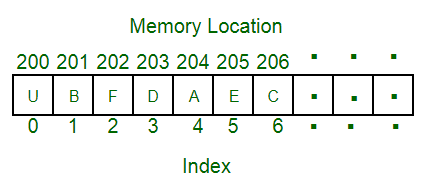
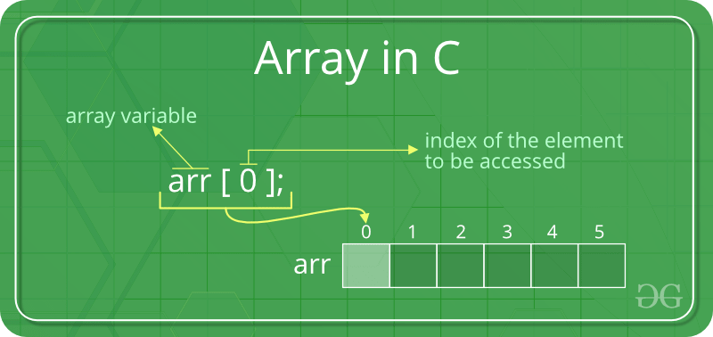

## 1. 概述

数组是存储在连续内存位置的元素的集合。其想法是将多个相同类型的元素存储在一起。这使得计算每个元素的位置变得更容易，
只需将偏移量添加到基值，即数组第一个元素的内存位置(通常由数组的名称表示)。基值是索引0，两个索引之间的差是偏移量。

为简单起见，我们可以将数组视为一组楼梯，其中每一步上都放置了一个值(假设为你的一个朋友)。在这里，你可以通过简单地知道朋友所走的步数来确定他们的位置。

记住：“下一个索引的位置取决于我们使用的数据类型”。



上图可以看作是楼梯的顶层视图，你位于楼梯的底部。每个元素都可以通过它在数组中的索引来唯一标识(就像你可以通过上面示例中的朋友所在的步骤来标识你的朋友一样)。

## 2. 数组大小

在Java语言中，数组有一个固定的大小，即一旦给它指定了大小，它就不能更改，即不能缩小它，也不能扩展它。
原因是为了扩展，如果我们更改大小，我们无法确定(不可能每次都这样)下一个内存位置是否可用。
收缩将不起作用，因为数组在声明时是静态分配内存的，因此编译器是唯一可以破坏它的。

数组中的索引类型：

+ 0(基于0的索引) - 数组的第一个元素下标为0。
+ 1(基于1的索引) - 数组的第一个元素下标为1。
+ n(基于n的索引) - 可以自由选择数组的基索引。通常，允许基于n的索引的编程语言也允许负索引值，并且其他标量数据类型(如枚举或字符)可以用作数组索引。



```
  @Test
  @DisplayName("whenCreateArrayAndAddElement_thenPrintShouldSuccess")
  void whenCreateArrayAndAddElement_thenPrintShouldSuccess() {
    int[] arr = new int[10];
    arr[0] = 5;
    assertEquals(5, arr[0]);
  }
```

这里打印值5，因为第一个元素的索引为0，在第0个索引处，我们已经指定了值5。

## 3. 数组的优缺点

### 3.1 优点

+ 数组允许对元素进行随机访问，这使得按位置访问元素的速度更快。
+ 数组具有更好的缓存局部性，这在性能上有很大的不同。
+ 数组使用一个名称表示相同类型的多个数据项。

### 3.2 缺点

你不能改变大小，即一旦你声明了数组，你就不能因为静态内存分配而改变它的大小。这里插入和删除很困难，因为元素存储在连续的内存位置中，并且移位操作也很昂贵。

以使用数组实现数据结构栈为例，存在一些明显的缺陷。

让我们看一下栈的pop操作。算法会是这样的。

1. 检查栈下溢
2. 将top自减1

因此，我们所做的是，指向最顶层元素的指针递减，意味着我们只是在限制我们的视图，即对我们来说看不到top指针后面的元素。
实际上该元素保留在那里占用了内存空间。如果你使用任何原始数据类型，那么它可能没问题，但对象数组会占用大量内存。

例子：

```
/ A character array in C/C++/Java
char arr1[] = {‘g’, ‘e’, ‘e’, ‘k’, ‘s’};

// An Integer array in C/C++/Java
int arr2[] = {10, 20, 30, 40, 50};

数组中第i个索引处的元素通常使用“arr[i]”访问。

For example:

arr1[0] gives us ‘g’
arr2[3] gives us 40
```

通常，字符数组称为“字符串”，而int或float数组仅称为数组。

## 4. 数组的应用

+ 数组存储相同数据类型的数据元素。
+ 用于解决矩阵问题。
+ 用作计算机中的查找表。
+ 数据库记录也通过数组实现。
+ 帮助实现排序算法。
+ 同一类型的不同变量可以保存在一个名称下。
+ 数组可用于CPU调度。
+ 用于实现其他数据结构，如栈、队列、堆、哈希表等。