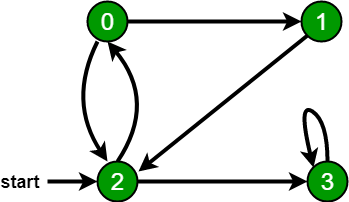
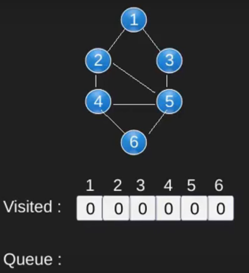
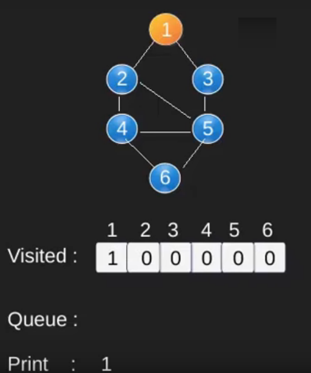
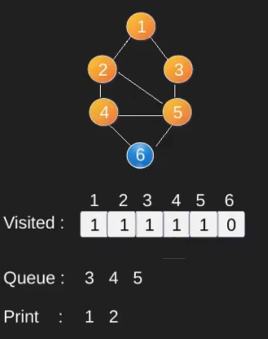
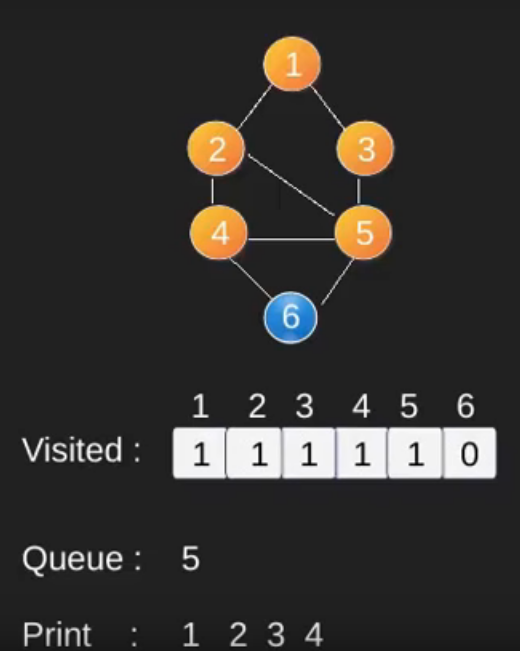
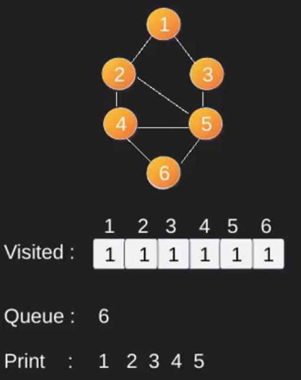

## 1. 概述

图的广度优先遍历(或搜索)类似于树的广度优先遍历。
这里唯一需要注意的是，与树不同，图可能包含循环，因此我们可能会再次来到同一个节点。
为了避免多次处理一个节点，我们可以使用一个布尔数组visited。为简单起见，假设所有顶点都可以从起始顶点到达。

例如，在下图中，我们从顶点2开始遍历。当我们到达顶点0时，我们寻找它的所有相邻顶点。
2也是0的相邻顶点。如果我们不标记已访问过的顶点，那么2将被再次处理，它将成为一个非终止进程。下图的广度优先遍历是2, 0, 3, 1。



## 2. 算法实现

以下是来自给定图的简单广度优先遍历的实现。

该实现使用图的邻接表表示。STL的列表容器用于存储相邻节点的列表和BFS遍历所需的节点队列。

```java
public class BFS_Graph {
  private int V; // 顶点的个数
  private LinkedList<Integer>[] adj; // 邻接表

  BFS_Graph(int V) {
    this.V = V;
    adj = new LinkedList[V];
    for (int i = 0; i < V; i++)
      adj[i] = new LinkedList<>();
  }

  void addEdge(int v, int w) {
    adj[v].add(w);
  }

  // 从给定的源s打印BFS遍历
  void BFS(int s) {
    // 将所有顶点标记为未访问(默认设置为false)
    boolean[] visited = new boolean[V];
    // 为BFS创建队列
    LinkedList<Integer> queue = new LinkedList<>();
    // 将当前节点标记为已访问并将其入队
    visited[s] = true;
    queue.add(s);
    while (queue.size() != 0) {
      // 从队列中取出一个顶点并打印它
      s = queue.poll();
      System.out.print(s + " ");
      // 获取出队顶点s的所有相邻顶点
      // 如果尚未访问相邻节点，则将其标记为已访问并将其入队
      Iterator<Integer> i = adj[s].iterator();
      while (i.hasNext()) {
        int n = i.next();
        if (!visited[n]) {
          visited[n] = true;
          queue.add(n);
        }
      }
    }
  }
}

class BFS_GraphUnitTest {

  @Test
  void givenGraph_whenPrintBFS_thenCorrect() {
    BFS_Graph graph = new BFS_Graph(4);
    graph.addEdge(0, 1);
    graph.addEdge(0, 2);
    graph.addEdge(1, 2);
    graph.addEdge(2, 0);
    graph.addEdge(2, 3);
    graph.addEdge(3, 3);
    System.out.println("以下是广度优先遍历 + " + "(从顶点2开始)");
    graph.BFS(2);
  }
}
```

时间复杂度：O(V+E)，其中V是节点数，E是边数。

辅助空间：O(V)。

## 3. 算法核心











请注意，上面的代码仅遍历从给定源顶点可到达的顶点。可能无法从给定顶点(例如断开连接图)到达所有顶点。

要打印所有顶点，我们可以修改BFS方法，从所有节点开始一个一个地进行遍历(就像[DFS修改版]()一样)。