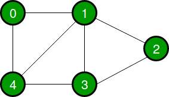
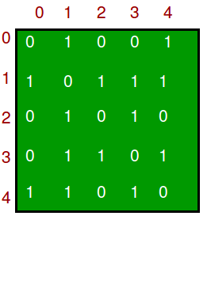
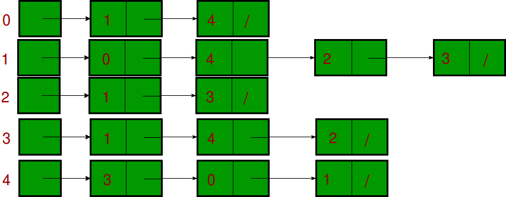

## 1. 概述

图是一种数据结构，由以下两个组件组成：

1. 一组有限的顶点，也称为节点。
2. 称为边的(u，v)形式的有序对的有限集。该对是有序的，因为在有向图(di图)的情况下(u，v)与(v，u)不同。
   (u, v)形式的对表示从顶点u到顶点v有一条边。边可能包含权重/值/成本。

图用于表示许多现实生活中的应用程序：图用于表示网络。网络可以包括城市或电话网络或电路网络中的路径。
图表也用于linkedIn、Facebook等社交网络。例如，在Facebook中，每个人都用一个顶点(或节点)表示。
每个节点都是一个结构，包含人员ID、姓名、性别和语言环境等信息。

下面是一个具有5个顶点的无向图示例。



以下两种是最常用的图表示方式。

1. 邻接矩阵
2. 邻接列表

还有其他的表示形式，例如，发生矩阵和发生列表。图表示的选择是针对特定情况的。这完全取决于要执行的操作类型和易用性。

## 2. 邻接矩阵

邻接矩阵是一个大小为V  V的二维数组，其中V是图中的顶点数。
设二维数组为adj[][]，adj[i][j] = 1表示从顶点i到顶点j有一条边。
无向图的邻接矩阵总是对称的。邻接矩阵也用于表示加权图。如果adj[i][j] = w，则从顶点i到顶点j有一条边，权重为w。

上述示例图的邻接矩阵为：



优点：更容易实现和理解。删除一条边需要O(1)个时间。像从顶点“u”到顶点“v”是否存在边的查询是有效的，并且可以在O(1)完成。

缺点：需要更多空间O(V<sup>2</sup>)。即使图是稀疏的(包含较少数量的边)，它也会消耗相同的空间。
添加一个顶点是O(V<sup>2</sup>)时间。计算一个顶点的所有邻节点需要O(V)时间(效率不高)。

## 3. 邻接列表

使用链表数组。数组的大小等于顶点的数量，设数组为array[]，array[i]表示与第i个顶点相邻的顶点链表。
这种表示也可以用来表示加权图。边的权重可以表示为对的列表。以下是上图的邻接表表示。



请注意，在下面的实现中，我们使用动态数组(Java中的ArrayList/C++中的向量)来表示邻接表而不是链表。vector实现具有缓存友好的优点。

```java
public class AdjacencyListGraph {

  /
    在无向图中添加边
   
    @param adj 邻接表
   /
  void addEdge(ArrayList<ArrayList<Integer>> adj, int u, int v) {
    adj.get(v).add(u);
    adj.get(u).add(v);
  }

  void printGraph(ArrayList<ArrayList<Integer>> adj) {
    for (int i = 0; i < adj.size(); i++) {
      System.out.println("n邻接表中的顶点" + i);
      System.out.print("head");
      for (int j = 0; j < adj.get(i).size(); j++)
        System.out.print(" -> " + adj.get(i).get(j));
      System.out.println();
    }
  }
}

class AdjacencyListGraphUnitTest {
  @Test
  void givenAdjList_whenCreateGrapth_thenPrint() {
    AdjacencyListGraph graph = new AdjacencyListGraph();
    int V = 5; // 图的顶点个数
    ArrayList<ArrayList<Integer>> adj = new ArrayList<>(V);
    // 初始化邻接表
    for (int i = 0; i < V; i++)
      adj.add(new ArrayList<>());
    // 添加边
    graph.addEdge(adj, 0, 1);
    graph.addEdge(adj, 0, 4);
    graph.addEdge(adj, 1, 2);
    graph.addEdge(adj, 1, 3);
    graph.addEdge(adj, 1, 4);
    graph.addEdge(adj, 2, 3);
    graph.addEdge(adj, 3, 4);
    graph.printGraph(adj);
  }
}
```

输出：

```
邻接表中的顶点0
head -> 1 -> 4

邻接表中的顶点1
head -> 0 -> 2 -> 3 -> 4

邻接表中的顶点2
head -> 1 -> 3

邻接表中的顶点3
head -> 1 -> 2 -> 4

邻接表中的顶点4
head -> 0 -> 1 -> 3
```

优点：节省空间O(|V|+|E|)。在最坏的情况下，图中可能有C(V, 2)条边，因此会占用O(V<sup>2</sup>)空间。
添加顶点更容易。计算一个顶点的所有邻节点需要最佳时间。

缺点：从顶点u到顶点v是否有边这样的查询效率不高，可以O(V)完成。

在现实生活中，图是稀疏的(|E| << |V|<sup>2</sup>)。这就是为什么邻接表数据结构通常用于存储图的原因。
邻接矩阵将强制(|V|<sup>2</sup>)限制此类算法的时间复杂度。

