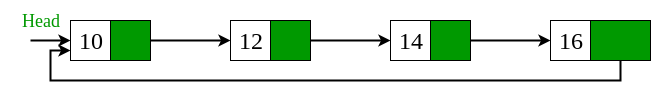

## 1. 问题描述

给定一个单链表，判断该链表是否为循环链表。如果链表不是以null结尾的，并且所有节点都以循环的形式连接，则称为循环链表。

下面是循环链表的一个示例。



空链表看作是循环链表。

注意，这个问题不同于[循环检测问题](FindLengthOfCycle_InLinkedList.md)，循环链表的所有节点都必须是环的一部分。

## 2. 算法实现

其思想是存储链表的头节点并遍历它。如果我们到达null，链表就不是循环的。若再次到达头节点，则链表为循环链表。

```java
public class CheckIfLinkedListIsCircular {

  public static boolean isCircular(Node head) {
    // 空链表视为循环链表
    if (head == null)
      return true;
    // 获取头节点的下一个节点
    Node node = head.next;
    // 如果链表不是循环链表，则node != null总会在某个时间点为false
    // 同样的，如果链表是循环链表，则node != head总会在某个时间点为false
    while (node != null && node != head)
      node = node.next;
    // 当循环完毕之后，如果node最后为头节点，则链表为循环链表
    return node == head;
  }

  public static Node newNode(int data) {
    Node temp = new Node();
    temp.data = data;
    temp.next = null;
    return temp;
  }
}
```