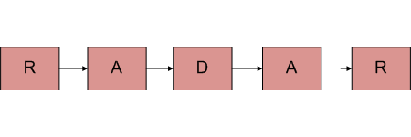
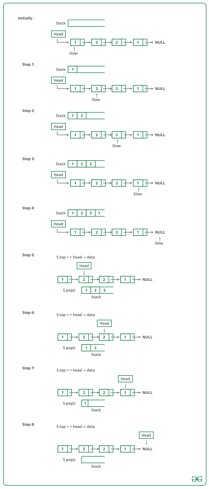

## 1. 问题描述

给定一个字符单链表，编写一个函数，如果给定链表是回文，则返回true，否则返回false。



## 2. 算法实现(使用栈)

+ 一个简单的解决方案是使用栈。这主要包括三个步骤。
+ 遍历给定的链表，并将每个访问的节点push到栈中。
+ 再次遍历链表。对于每个访问的节点，从栈中弹出一个节点，并将栈中弹出的节点数据与当前访问的节点数据进行比较。
+ 如果所有节点都匹配，则返回true，否则返回false。

如下图所示：



以下是上述方法的具体实现：

```
public boolean isPalindrome(Node head) {
  Node current = head;
  Stack<Integer> stack = new Stack<>();
  boolean isPalindrome = true;
  while (current != null) {
    stack.push(current.data);
    current = current.next;
  }
  current = head;
  while (current != null) {
    if (!stack.pop().equals(current.data))
      isPalindrome = false;
    current = current.next;
  }
  return isPalindrome;
}
```

时间复杂度：O(n)。

## 3. 通过反转链表

此方法需要O(n)时间和O(1)个额外空间。

1. 获取链表的中间位置。
2. 反转链表的后半部分。
3. 检查前半部分和后半部分是否相同。
4. 通过再次反转后半部分并将其附加回前半部分来构建原始链表

为了将链表分成两半，这里使用双指针找到链表的中间元素。

当节点数为偶数时，前半部分和后半部分正好包含一半的节点。这种方法的挑战在于处理节点数为奇数的情况。
我们不希望中间节点作为链表的一部分，因为我们将比较它们是否相等。对于奇数情况，我们使用单独的变量“middleNode”。

```java
public class LinkedListAlgorithms {
  Node head;
  Node slowPointer, fastPointer, rightPartition;

  public boolean isPalindromeUsingReverse(Node head) {
    boolean isPalindrome = true;
    slowPointer = head;
    fastPointer = head;
    Node previousOfSlowPointer = head;
    Node middleNode = null; // 处理链表长度为奇数的情况
    if (head != null && head.next != null) {
      // 获取列表的中间位置。slowPointer将作为中点
      while (slowPointer != null && fastPointer != null && fastPointer.next != null) {
        fastPointer = fastPointer.next.next;
        // 我们需要previousOfSlowPointer具有奇数元素的链表
        previousOfSlowPointer = slowPointer;
        slowPointer = slowPointer.next;
      }
      /
          当链表存在偶数个元素时，fastPointer将变为null，对于链表元素个数为奇数，不为null。
          我们需要跳过奇数情况的中间节点，并将其存储在某个位置，以便我们可以恢复原始链表。
       /
      if (fastPointer != null) {
        middleNode = slowPointer;
        slowPointer = slowPointer.next;
      }
      // 现在反转右半部分，与左半部分进行比较
      rightPartition = slowPointer;
      previousOfSlowPointer.next = null; // null终止左半部分
      reverse(); // 反转右半部分
      isPalindrome = compareLists(head, rightPartition); // 比较
      reverse(); // 继续反转右半部分，重新构建原始链表
      if (middleNode != null) {
        // 如果存在中间节点(奇数大小的情况)，则不是左半部分或右半部分的一部分。
        previousOfSlowPointer.next = middleNode;
        middleNode.next = rightPartition;
      } else
        previousOfSlowPointer.next = rightPartition;
    }
    return isPalindrome;
  }

  public void reverse() {
    Node previous = null;
    Node current = rightPartition;
    Node next;
    while (current != null) {
      next = current.next;
      current.next = previous;
      previous = current;
      current = next;
    }
    rightPartition = previous;
  }

  private boolean compareLists(Node list1, Node lise2) {
    Node temp1 = list1;
    Node temp2 = lise2;

    while (temp1 != null && temp2 != null) {
      if (temp1.data != temp2.data)
        return false;
      temp1 = temp1.next;
      temp2 = temp2.next;
    }
    return temp1 == null && temp2 == null;
  }
}
```

时间复杂度：O(n)

辅助空间：O(1)

## 4. 使用递归

使用left和right两个指针。使用递归分别向右和向左移动，并在每个递归调用中执行以下检查。

1. 子链表是回文。
2. 当前left和right的值匹配。

如果上述两个条件均为true，则返回true。

其思想是使用函数调用堆栈作为容器。递归遍历直到链表末尾。当我们从last为null返回时，我们将位于最后一个节点。
要与链表的第一个节点进行比较的最后一个节点。

为了访问链表的第一个节点，我们需要链表头在最后一次递归调用中可用。因此，我们也将head传递给递归函数。
如果两者都匹配，我们需要比较(2，n-2)个节点。同样，当递归返回到(n-2)第二个节点时，我们需要从头部引用第二个节点。
我们在前一次调用中推进头指针，以指向链表中的下一个节点。

然而，诀窍是识别双指针。传递单个指针就像传递值一样好，我们将一次又一次地传递同一个指针。我们需要传递头指针的地址来反映父递归调用的变化。

```
public boolean isPalindromeUsingRecursive(Node head) {
  return isPalindromeUtil(head);
}
private boolean isPalindromeUtil(Node right) {
  Node left = head;
  if (right == null)
    return true;
  boolean isp = isPalindromeUtil(right.next);
  if (!isp)
    return false;
  boolean isp1 = right.data == left.data;
  left = left.next;
  return isp1;
}
```

时间复杂度：O(n)。

辅助空间：如果考虑函数调用堆栈大小，则为O(n)，否则为O(1)。