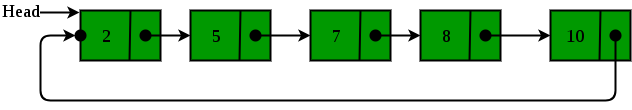

## 1. 问题描述

我们已经在[循环链表简介](CircularLinkedList_Introduction.md)一文讨论了循环链表新节点的添加和遍历：

在本文中，我们将介绍如何从循环链表中删除节点。考虑如下所示的链表：



给定一个节点，我们的任务是从循环链表中删除该节点。

示例：

```
输入: 2->5->7->8->10->(2) data = 5
输出: 2->7->8->10->(2)

输入: 2->5->7->8->10->(2) data = 7
输出: 2->5->8->10->(2)
```

## 2. 算法实现

情况1：链表为空

+ 如果链表为空，直接return。

情况2：链表不为空

+ 如果链表不为空，那么我们定义两个指针current和previous，并初始化current指向head节点。
+ 使用current遍历链表找到要删除的节点，在移动current到下一个节点之前，每次设置previous = current。
+ 如果找到该节点，检查它是否是链表中的唯一节点。如果是，则设置head = null。
+ 如果链表有多个节点，则检查它是否是链表的第一个节点。检查这个的条件为(current == head)。
  如果是，则移动previous直到到达最后一个节点。previous到达最后一个节点后，
  设置head = head.next和previous.next = head。删除current。
+ 如果current不是第一个节点，我们检查它是否是链表中的最后一个节点。检查的条件是(current.next == head)。
+ 如果current是最后一个节点。设置previous.next = head并删除节点current。
+ 如果要删除的节点既不是第一个节点也不是最后一个节点，则设置previous.next = current.next并删除current。

完整的删除节点代码实现如下：

```java
public class CircularLinkedListDeletion {

  public static Node deleteNode(Node head, int key) {
    if (head == null)
      return null;
    Node current = head;
    Node previous = new Node();
    // 找到需要删除的节点
    while (current.data != key) {
      if (current.next == head) {
        System.out.print("nGiven node is not found" + " in the list!!!");
        break;
      }
      previous = current;
      current = current.next;
    }
    // 检查该节点是否为唯一的节点
    if (current == head && current.next == head) {
      head = null;
      return head;
    }
    // 如果有多个节点，检查它是否是第一个节点
    if (current == head) {
      previous = head;
      while (previous.next != head)
        previous = previous.next;
      head = current.next;
      previous.next = head;
      // 检查该节点是否为最后一个节点
    } else if (current.next == head)
      previous.next = head;
    else
      previous.next = current.next;
    return head;
  }

  static Node push(Node head, int data) {
    Node newNode = new Node(data);
    newNode.next = head;
    if (head != null) {
      Node temp = head;
      while (temp.next != head)
        temp = temp.next;
      temp.next = newNode;
    } else
      newNode.next = newNode;
    head = newNode;
    return head;
  }

  public static void printList(Node head) {
    Node current = head;
    if (current != null) {
      do {
        int data = current.data;
        System.out.print(data + " ");
        current = current.next;
      } while (current != head);
    }
  }
}
```