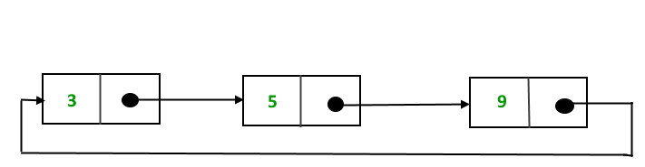
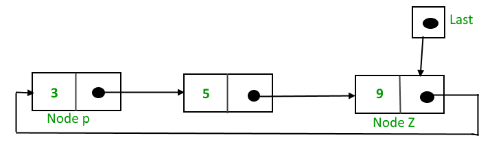
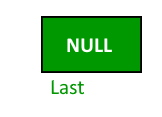
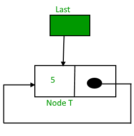
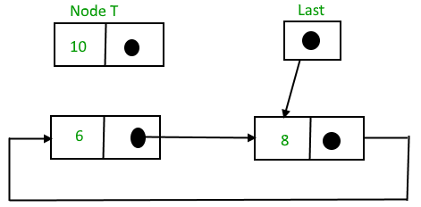
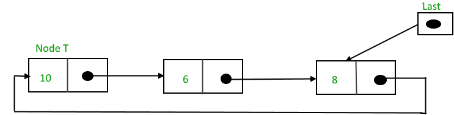
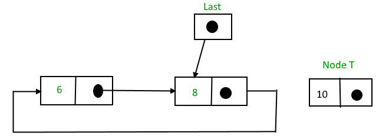
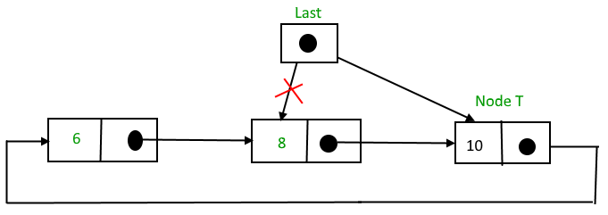
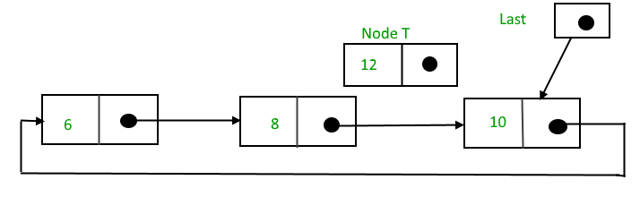
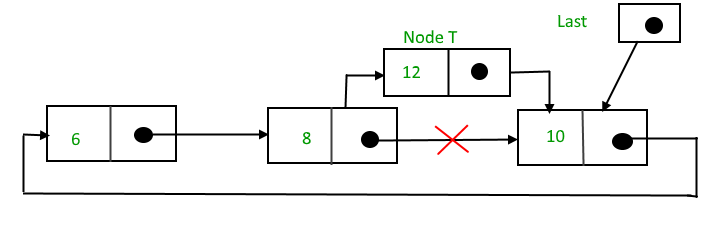

## 1. 概述

循环链表是一种链表，其中所有节点都连接成一个圆。与单链表不同的是，没有任何节点的next节点为null。循环链表可以是单循环链表或双循环链表。


## 2. 循环链表的优点

1. 任何节点都可以是起点。我们可以从任何一个节点开始遍历整个链表。我们只需要当再一次访问第一个遍历的节点时停止。
2. 对于队列的实现非常有用。与[此]()实现不同，如果使用循环链表，则不需要维护前后两个指针。
   我们可以维护一个指向最后插入的节点的指针，而front始终可以作为last.next来获取。
3. 循环链表在应用程序中非常有用，可以重复遍历链表。例如，当一台PC上运行多个应用程序时，操作系统通常会将正在运行的应用程序放在一个链表中，
   然后循环它们，给每个应用程序一段时间来执行，当CPU分配给另一个应用程序时然后让它们等待。
   操作系统可以方便地使用循环链表，这样当它到达链表的末尾时，就可以循环到链表的前面。
4. 循环双链表用于实现诸如斐波那契堆之类的高级数据结构。

为什么需要使用循环链表？在单链表中，为了访问链表的任何节点，我们从第一个节点开始遍历。如果我们位于链表中间的任何节点，
那么就不可能访问给定节点之前的节点。这个问题可以通过稍微改变单链表的结构来解决。在单链表中，最后一个节点的下一个节点为null。
如果我们将最后一个节点指向第一个节点，那么我们可以到达前面的节点。由此形成的结构是一个循环单链表，如下所示：



## 3. 插入节点

为了实现循环单链表，我们使用一个指向链表最后一个节点的额外指针。如果我们有一个指针last指向最后一个节点，那么last.next将指向第一个节点。



last指针指向节点Z，last.next指针指向节点P。

为什么我们使用指向最后一个节点而不是第一个节点的指针？

为了在开头插入节点，我们需要遍历整个链表。此外，为了在末尾插入，必须遍历整个链表。
如果不使用start指针，而是使用指向最后一个节点的last指针，那么在这两种情况下都不需要遍历整个链表。
因此，无论链表的长度如何，在开头或结尾插入节点都只需要恒定的时间。

一般来说可以通过四种方式插入节点：

+ 在空链表中插入
+ 在链表开头插入
+ 在链表末尾插入
+ 在节点之间插入

### 3.1 在空链表中插入节点

最初，当链表为空时，last指针将为null。



插入节点T后：



T是最后一个节点，因此指针last指向节点T。同时T也是第一个节点，因此T指向自身。

以下是将节点插入到空链表的实现：

```java
public class CircularLinkedList {

  public Node addToEmpty(Node last, int newData) {
    if (last != null)
      return last;
    // 创建节点
    Node newNode = new Node(newData);
    last = newNode;
    // 注意：当只有一个节点时。我们将单个节点指向自身
    newNode.next = last;
    return last;
  }
}
```

### 3.2 在链表开头插入节点

要在链表开头插入节点，执行以下操作：

1. 创建一个节点，例如T
2. 使T.next = last.next
3. last.next = T



插入后：



以下是将节点插入到链表开头的实现：

```java
public class CircularLinkedList {

  public Node addBegin(Node last, int newData) {
    if (last == null)
      return addToEmpty(null, newData);
    // 创建节点
    Node newNode = new Node(newData);
    // 调整链接
    newNode.next = last.next;
    last.next = newNode;
    return last;
  }
}
```

时间复杂度：O(1)，要在开头插入节点，无需遍历链表，时间恒定。

空间复杂度：O(1)。

### 3.3 在链表末尾插入节点

要在链表末尾插入节点，执行以下操作：

1. 创建一个节点，例如T
2. 使T.next = last.next
3. last.next = T
4. last = T



插入后：



以下是将节点插入到链表末尾的实现

```java
public class CircularLinkedList {

  public Node addEnd(Node last, int newData) {
    if (last == null)
      return addToEmpty(null, newData);
    // 创建节点
    Node newNode = new Node(newData);
    // 调整链接
    newNode.next = last.next;
    last.next = newNode;
    last = newNode;
    return last;
  }
}
```

时间复杂度：O(1)，在链表末尾插入节点。不需要遍历链表，因为我们使用last指针，因此它的时间是恒定的。

空间复杂度：O(1)。

### 3.4 在节点之间插入节点

要在两个节点之间插入新节点，执行以下步骤：

1. 创建一个节点，例如T
2. 找到T需要插入的前一个节点，假设该节点是P
3. 使T.next = P.next
4. P.next = T

假设需要在值为8的节点之后插入12，我们首先需要找到节点8：



搜索和插入后：



以下是将节点插入到链表节点之间的实现：

```java
public class CircularLinkedList {

  public Node addAfter(Node last, int newData, int item) {
    if (last == null)
      return null;
    Node p = last.next;
    do {
      if (p.data == item) {
        Node newNode = new Node(newData);
        newNode.next = p.next;
        p.next = newNode;
        if (p == last)
          last = newNode;
        return last;
      }
      p = p.next;
    } while (p != last.next);
    return last;
  }
}
```

时间复杂度：O(n)。

空间复杂度：O(1)。

## 4. 遍历

在传统的单链表中，我们从头节点开始遍历链表，当到达null时停止遍历。在循环链表中，我们在再次到达第一个遍历的节点时停止遍历。

下面是链表遍历的Java代码实现。

```java
public class CircularLinkedList {

  public void printList(Node head) {
    Node current = head;
    // 如果链表不为null
    if (current != null) {
      // 我们一直循环，直到再次遍历到头节点
      do {
        int data = current.data;
        System.out.print(data + " ");
        current = current.next;
      } while (current != head);
    }
  }
}
```