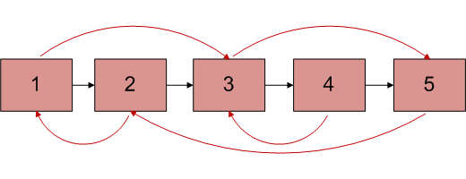
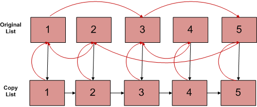

## 1. 问题描述

给你一个双链表，每个节点的一个指针指向下一个节点，就像在单链表中一样。然而，第二个指针可以指向链表中的任何节点，而不仅仅是前一个节点。
现在在O(n)时间内编写一个程序来这个链表。也就是说，编写一个程序来创建这个链表的副本。

让我们将第二个指针称为arbit(任意)指针，因为它可以指向链表中的任意节点。



如上图，arbit指针显示为红色，next指针显示为黑色。

## 2. 使用O(n)额外空间

此方法首先将(原始链表的)next和arbit映射存储在数组中，然后修改原始链表(创建副本)，创建副本。最后恢复原始链表。

1. 使用next指针在链表中创建所有节点。
2. 存储原始链表的节点及其next指针映射。
3. 将原链表中所有节点的next指针改为指向拷贝链表中对应的节点。

下图显示了以上3个步骤后两个链表的状态。红色箭头显示arbit指针，黑色箭头显示next指针。



4. 将链表中所有节点的arbit指针更改为指向原始链表中的对应节点。
5. 现在，在链表中构建arbit指针，如下所示，并恢复原始链表中节点的next指针。

```
copy_list_node.arbit = copy_list_node.arbit.arbit.next;
copy_list_node = copy_list_node.next; 
```

6. 从存储的映射中恢复原始链表中的next指针(在步骤2中)。

时间复杂度：O(n)

辅助空间：O(n)

## 3. 使用恒定的额外空间

此解决方案使用常量空间。

1. 创建节点1的副本并将其插入到原始链表中的节点1和节点2之间，创建2的副本并将其插入到2和3之间。
   以这种方式继续，在第N个节点之后添加N的副本
2. 现在以这种方式arbit指针

```
original.next.arbit = original.arbit.next;
```

这是有效的，因为original.next只不过是original的副本，而Original.arbit.nextnext只不过是arbit的副本。

3. 现在，以这种方式在单个循环中恢复原始和链表。

```
original.next = original.next.next;
copy.next = copy.next.next;
```

4. 确保original.next的最后一个元素为null。

时间复杂度：O(n)

辅助空间：O(1)