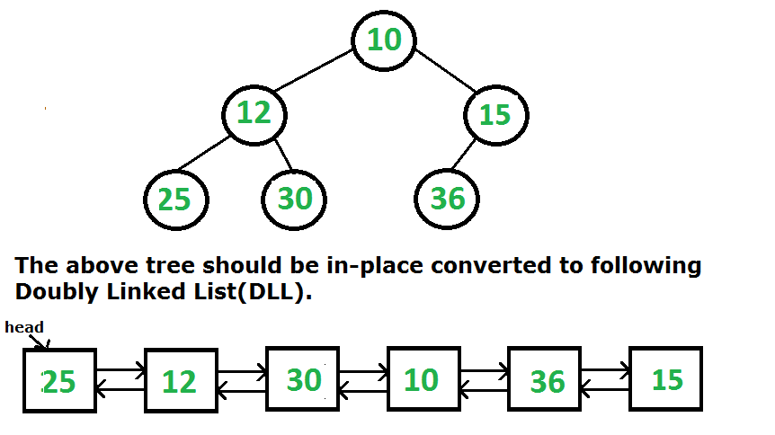

## 1. 问题描述

给定一个二叉树(BT)，将其转换为双向链表(DLL)。BT节点中的left指针和right指针分别用作转换后的DLL中的previous指针和next指针。
对于给定的二叉树，DLL中的节点顺序必须与中序遍历中的相同。中序遍历的第一个节点(BT中最左边的节点)必须是DLL的头节点。



## 2. 算法分析

这里的问题更简单，其解决方案背后的思想非常简单明了。

1. 如果左子树存在，则处理左子树。
    1. 递归地将左子树转换为DLL。
    2. 然后在左子树中找到根的中序前驱(中序前驱是左子树中最右边的节点)。
    3. 将中序前驱作为根的previous节点，将根作为中序前驱的next节点。
2. 如果存在右子树，则处理右子树(以下3个步骤与处理左子树类似)。
    1. 递归地将右子树转换为DLL。
    2. 然后在右子树中找到根的中序后继(中序后继是右子树中最左边的节点)。
    3. 将中序后继作为根的next节点，将根作为中序后继的previous节点。
3. 找到最左边的节点并将其返回(最左边的节点始终是转换后的DLL的头节点)。

## 3. 算法实现

```java
// 二叉树节点类
public class TreeNode {
  int data;
  TreeNode left;
  TreeNode right;

  public TreeNode(int data) {
    this.data = data;
    left = right = null;
  }
}

public class BinaryTreeToDoublyLinkedList {
  TreeNode root;

  TreeNode binaryTreeToList(TreeNode root) {
    if (root == null)
      return root;
    // binaryTreeToListUtil()转换成DDL
    root = binaryTreeToListUtil(root);
    // binaryTreeToListUtil()返回转换后的DLL的根节点。我们需要指向最左边节点的指针，它是构建的DLL的头节点，所以移动到最左边的节点
    while (root.left != null)
      root = root.left;
    return root;
  }

  private TreeNode binaryTreeToListUtil(TreeNode root) {
    // 基准条件
    if (root == null)
      return root;
    // 转换左子树并链接到根节点
    if (root.left != null) {
      // 转换左子树
      TreeNode left = binaryTreeToListUtil(root.left);
      // 找到中序前驱节点.在这个循环之后，left将指向中序前驱节点
      for (; left.right != null; left = left.right) ;
      // 将root节点作为中序前驱节点的下一个节点
      left.right = root;
      // 将中序前驱节点作为root的上一个节点
      root.left = left;
    }
    if (root.right != null) {
      // 转换右子树
      TreeNode right = binaryTreeToListUtil(root.right);
      // 找到中序后继节点.在这个循环之后，right将指向中序后继节点
      for (; right.left != null; right = right.left) ;
      // 将root节点作为中序后继节点的上一个节点
      right.left = root;
      // 将中序后继节点作为root节点的下一个节点
      root.right = right;
    }
    return root;
  }
}
```

## 4. 中序遍历实现

1. 以中序遍历的方式遍历树
2. 在访问每个节点时，跟踪DLL的头和尾指针，使用尾指针将每个访问的节点插入到DLL的末尾。
3. 返回头节点。

以下是上述方法的具体实现：

