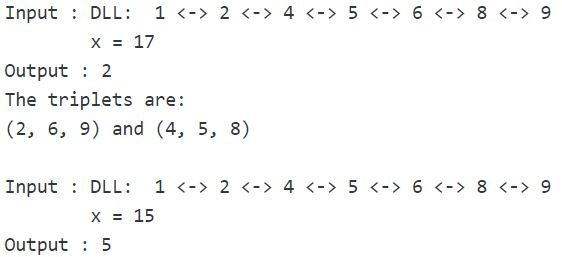

## 1. 问题描述

给定一个不同元素节点的排序双向链表(没有两个节点具有相同的数据)和一个值x。计算链表中总和为给定值x的三元组。

示例：



## 2. 原始方法

使用三个嵌套循环生成所有三元组，并检查三元组中的元素总和是否为x。

```java
public class CountTriplets {
  DoublyLinkedList doublyLinkedList;
  Node head;

  public CountTriplets(DoublyLinkedList doublyLinkedList) {
    this.doublyLinkedList = doublyLinkedList;
    head = doublyLinkedList.head;
  }

  public static int countTripletsUsingLoop(Node head, int x) {
    int count = 0;
    Node first, second, third;
    for (first = head; first != null; first = first.next)
      for (second = first.next; second != null; second = second.next)
        for (third = second.next; third != null; third = third.next)
          if ((first.data + second.data + third.data) == x)
            count++;
    return count;
  }
}
```

时间复杂度：O(n<sup>3</sup>)

辅助空间：O(1)

## 3. 哈希

创建一个哈希表，其中(key,value)表示为(节点数据，节点指针)。遍历双向链表并将每个节点的数据及其指针存储在哈希表中。
现在，生成每对可能的节点。对于每对节点，计算p_sum(两个节点中的数据之和)并检查哈希表中是否存在(x-p_sum)。
如果存在，则还要验证该pair中的两个节点与哈希表中与(x-p_sum)关联的节点不同，最后增加count。
返回(count / 3)，因为在上述过程中每个三元组计算3次。

```java
public class CountTriplets {
  DoublyLinkedList doublyLinkedList;
  Node head;

  public CountTriplets(DoublyLinkedList doublyLinkedList) {
    this.doublyLinkedList = doublyLinkedList;
    head = doublyLinkedList.head;
  }

  public static int countTripletsUsingHash(Node head, int x) {
    Node first, second, third;
    int count = 0;
    // 创建HashMap，key为节点数据，value为节点引用
    HashMap<Integer, Node> valueNodes = new HashMap<>();
    // 遍历整个链表，添加到map中
    for (first = head; first != null; first = first.next)
      valueNodes.put(first.data, first);
    // 生成所有可能的二元组
    for (second = head; second != null; second = second.next)
      for (third = second.next; third != null; third = third.next) {
        // 计算当前二元组对的和
        int p_sum = second.data + third.data;
        // 如果map中包含一个(x - p_sum)的key，并且其value与当前两个节点不相同，count++。
        if (valueNodes.containsKey(x - p_sum)
            && valueNodes.get(x - p_sum) != second
            && valueNodes.get(x - p_sum) != third)
          count++;
      }
    // 每个三元组都统计了3次，因此将结果除以3。
    return count / 3;
  }
}
```

时间复杂度：O(n<sup>2</sup>)

辅助空间：O(n)

## 4. 使用双指针

从左到右遍历链表。对于遍历过程中的每个current节点，初始化两个指针first = current.next，和last = 链表的最后一个节点。
现在，计算链表中从第一个到最后一个指针的总和为(x - 当前节点的数据)的对。添加到三元组的total_count中。
指向最后一个节点的指针在开始时找到一次。

```java
public class CountTriplets {
  DoublyLinkedList doublyLinkedList;
  Node head;

  public CountTriplets(DoublyLinkedList doublyLinkedList) {
    this.doublyLinkedList = doublyLinkedList;
    head = doublyLinkedList.head;
  }

  /
    统计两个节点的数据和为给定value的对数
    第一次调用时，first = head.next，second = last，value = x - head.data
    第二次调用时，first = head.next.next，second = last，value = x - head.next.data
    以此类推...
   /
  public static int countPairsUsingTwoPointer(Node first, Node second, int value) {
    int count = 0;
    // 当两个节点的任何一个变为null，或两个节点相同，或两个节点交错时，循环结束
    while (first != null && second != null && first != second && second.next != first) {
      // 找到两个节点的和为value的对
      if ((first.data + second.data) == value) {
        count++;
        // 右移first指针
        first = first.next;
        // 左移second指针
        second = second.previous;
      } else if ((first.data + second.data) > value)
        // 如果两个节点的和大于value，左移second指针
        second = second.previous;
      else
        // 否则右移first指针
        first = first.next;
    }
    return count;
  }

  public static int countTripletsUsingTwoPointer(Node head, int x) {
    Node current, first, last;
    int count = 0;
    // 如果头节点为null，返回0
    if (head == null)
      return 0;
    last = head;
    // 找到最后一个节点
    while (last.next != null)
      last = last.next;
    // 遍历链表
    for (current = head; current != null; current = current.next) {
      int value = x - current.data;
      // 找到和为x - current.data的节点对的总数
      count += countPairsUsingTwoPointer(current.next, last, value);
    }
    return count;
  }
}
```

时间复杂度：O(n<sup>2</sup>)

辅助空间：O(1)