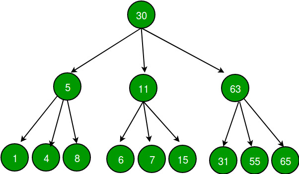

## 1. 问题描述

给定一棵三叉树，从中创建一个双向链表。三叉树就像二叉树一样，但它有三个节点，即左、中、右。

双链表应包含以下属性：

1. 三叉树的left指针应该作为双向链表的previous指针。
2. 三叉树的middle指针不应该指向任何东西。
3. 三叉树的right指针应该作为双向链表的next指针。
4. 三叉树的每个节点在其子树之前插入到双向链表中，对于任何节点，其左孩子将首先插入，然后是中间和右孩子(如果有)。

对于上面的例子，为下图的三叉树形成的链表应为null <- 30 <-> 5 <-> 1 <-> 4 <-> 8 <-> 11 <-> 6<-> 7<-> 15 <-> 63 <-> 31 <-> 55 <-> 65 ->null

