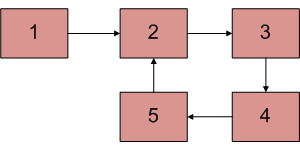
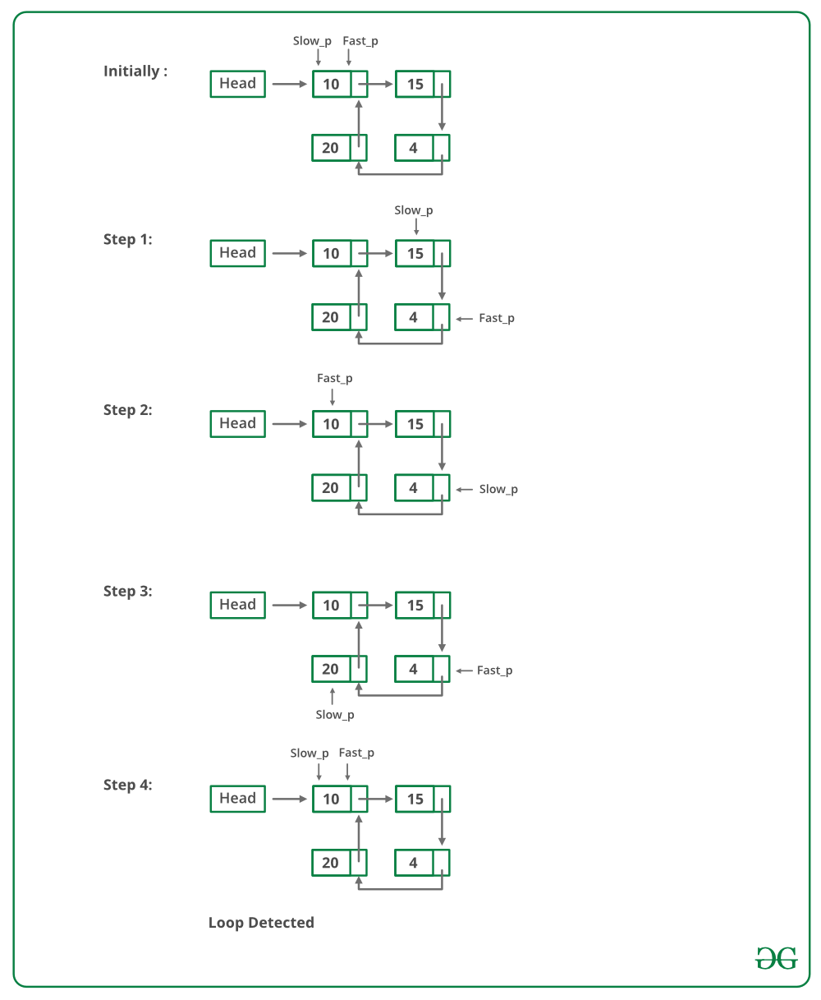

## 1. 问题描述

给定一个链表，检查链表是否有环。下图显示了带有环的链表。



下面介绍执行此操作的不同方法。

## 2. 哈希算法

遍历链表，并将节点放在HashSet中。在任何时候，如果头节点为null，则返回false；
如果当前节点中的下一个节点指向HashSet保存到任何节点，则返回true。

```java
public class DetectCycle {

  public boolean detectLoop(Node head) {
    HashSet<Node> set = new HashSet<>();
    while (head != null) {
      // 如果集合中已包含当前遍历的节点，说明存在环，因为我们第二次遍历遇见该节点
      if (set.contains(head))
        return true;
      // 如果第一次遍历该节点，添加到集合中
      set.add(head);
      head = head.next;
    }
    return false;
  }
}
```

时间复杂度：O(n)。只需要一次循环遍历。

辅助空间：O(n)，n是在HashSet中存储值所需的空间。

## 3. 修改链表结构

通过修改链表的数据结构，无需HashSet即可解决此问题。

+ 每个节点都有一个visited标志。
+ 遍历链表并标记已访问的节点。
+ 如果再次遍历到访问过的节点，则存在一个环。此解决方案在O(n)中有效，但需要节点添加一个额外的字段。

此解决方案的一个变体不需要修改基本数据结构，可以使用哈希来实现，只需将访问节点存储在哈希中，如果你看到哈希中已经存在的节点，那么就会有一个环。

以下为具体实现：

```java
public class Node {
  public int data;
  public Node next;
  boolean flag; // 添加一个flag字段，用于表示节点是否已被访问

  public Node(int d) {
    data = d;
    next = null;
  }
}

public class DetectCycle {

  public boolean detectLoopThroughAddFlag(Node head) {
    while (head != null) {
      // 如果当前节点之前已被遍历过，说明存在环，返回true
      if (head.flag)
        return true;
      // 如果当前节点为第一次遍历，则设置flag标志为true
      head.flag = true;
      head = head.next;
    }
    return false;
  }
}
```

时间复杂度：O(n)，只需要一次循环遍历。

辅助空间：O(1)，无需额外空间。

## 4. Floyd循环检测算法

这是最快的方法，如下所述：

+ 使用两个指针遍历链表。
+ 一个指针(slowPointer)一次移动一个位置，将另一个指针(fastPointer)一次移动两个位置。
+ 如果两个指针在同一个节点上相遇，则存在一个环。若指针不相交，那么链表就不存在环。

如下图所示：



Floyd循环检测算法的实现：

```java
public class DetectCycle {

  public boolean floydCycleFinding(Node head) {
    // 初始化快慢指针指向头节点
    Node slowPointer = head;
    Node fastPointer = head;
    while (slowPointer != null && fastPointer != null && fastPointer.next != null) {
      slowPointer = slowPointer.next;
      fastPointer = fastPointer.next.next;
      // 如果两个指针相等，返回true
      if (slowPointer == fastPointer)
        return true;
    }
    return false;
  }
}
```

时间复杂度：O(n)，只需要一次循环遍历。

辅助空间：O(1)，不需要额外空间。

## 5. 标记已访问的节点而不修改链表的数据结构

在此方法中，将创建一个临时节点。使遍历的每个节点的下一个指针都指向这个临时节点。
这样，我们就可以使用节点的下一个指针作为标志来指示节点是否已被遍历。
检查每个节点，以查看下一个节点是否指向临时节点。对于循环的第一个节点，我们第二次遍历它时，这个条件将为真，因此我们发现环存在。
如果我们遇到一个指向null的节点，那么环就不存在。

以下是上述方法的具体实现：

```java
public class DetectCycle {

  public boolean detectLoopUsingTempNode(Node head) {
    Node temp = new Node(1);
    while (head != null) {
      if (head.next == null)
        return false;
      if (head.next == temp)
        return true;
      Node next = head.next;
      head.next = temp;
      head = next;
    }
    return false;
  }
}
```

时间复杂度：O(n)，只需要一次循环遍历。

辅助空间：O(1)，不需要额外空间。

## 6. 存储长度

在这个方法中，创建两个指针，first(始终指向头部)和last。每次last指针移动时，我们都会计算first和last之间的节点数，
并检查当前节点数是否大于之前的节点数，如果是，则继续移动last指针，否则意味着我们已经到达环的末端，返回true。

以下为具体实现：

```java
public class DetectCycle {

  public boolean detectLoopUsingCount(Node head) {
    // first指针始终指向头节点
    Node first = head;
    // last指针初始指向头节点
    Node last = head;
    // currentLength表示first到last之间的节点数
    int currentLength = 0;
    // previousLength表示上一个节点到last之间的节点数
    int previousLength = -1;
    while (currentLength > previousLength && last != null) {
      // 将previousLength设置为currentLength，然后更新currentLength
      previousLength = currentLength;
      // 计算距离
      currentLength = distance(first, last);
      // 移动last指针
      last = last.next;
    }
    return last != null;
  }

  // 返回first节点到last节点的距离
  private int distance(Node first, Node last) {
    int count = 0;
    Node current = first;
    while (current != last) {
      count++;
      current = current.next;
    }
    return count + 1;
  }
}
```

时间复杂度：O(n<sup>2</sup>)

辅助空间：O(1)

## 7. 其他方法

1. 这是最简单的方法，我们唯一要做的就是为链表中不在给定范围内的节点的每个数据分配一个新值。
2. 假设(1 <= 节点上的数据 <= 10^3)，然后在访问节点后，将数据分配为-1，因为它超出了给定的范围。

为了更好地理解，请看下面给出的代码：

```java
public class DetectCycle {

  public boolean detectLoopOtherMethod(Node head) {
    if (head == null)
      return false;
    else {
      while (head != null) {
        if (head.data == -1)
          return true;
        else {
          head.data = -1;
          head = head.next;
        }
      }
    }
    return false;
  }
}
```

时间复杂度：O(n)

辅助空间：O(1)