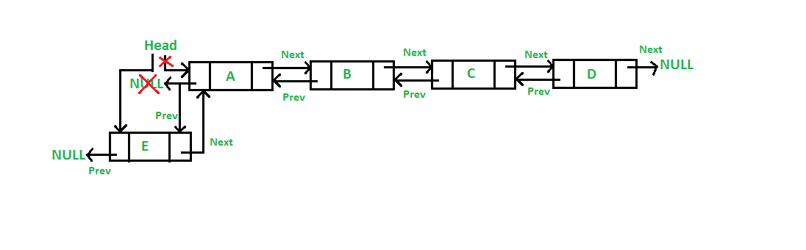
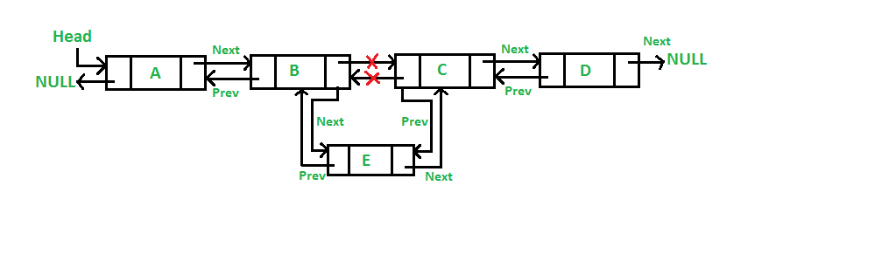
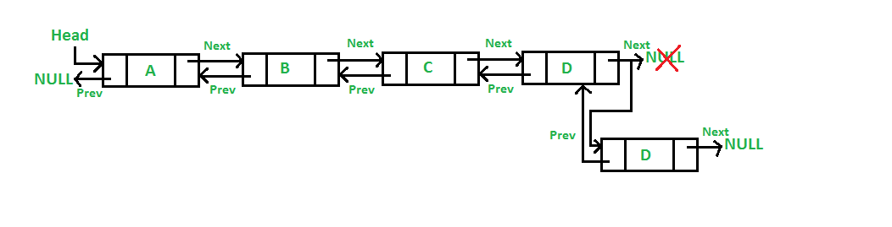
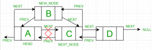
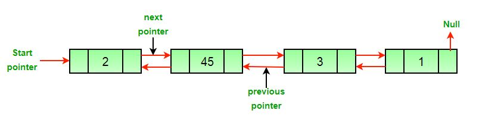
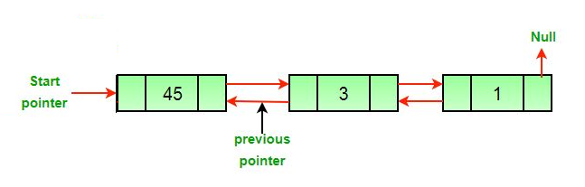
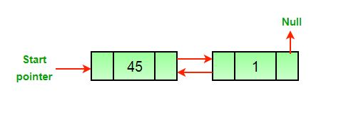
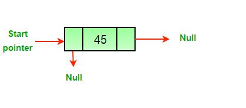
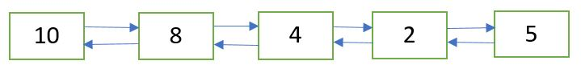
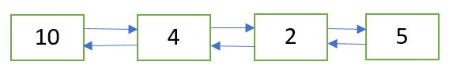

## 1. 概述

双向链表(DLL)的每个节点包含一个额外的指针，通常称为previous指针，以及next指针和data。


下面是用Java语言表示的DLL节点。

```java
public class DLL {
  Node head;

  class Node {
    int data;
    Node previous;
    Node next;

    // 构造一个新节点
    // next和previous默认初始化为null
    Node(int d) {
      data = d;
    }
  }
}
```

## 2. 优缺点

以下是双向链表相对于单向链表的优点和缺点。

相对于单向链表的优势：

1. DLL可以向前和向后遍历。
2. 如果给出要删除的节点的指针，DLL中的删除操作会更有效。
3. 我们可以在给定节点前快速插入一个新节点。

在单向链表中，要删除节点，需要指向被删除节点上一个节点的指针。为了获得上一个节点，有时会遍历链表。
在DLL中，我们可以使用previous指针获取上一个节点。

相对于单向链表的劣势：

1. DLL的每个节点都需要为previous指针提供额外的空间。但是，也可以使用单指针实现DLL。
2. 所有操作都需要维护一个额外的指针。例如，在插入中，我们需要修改previous指针和next指针。
   例如，在接下来用于不同位置插入的函数中，我们需要1到2个额外步骤来设置previous指针。

## 3. 插入节点

可以通过四种方式添加节点：

1. 在DLL的前面
2. 在给定节点之后
3. 在DLL的末尾
4. 在给定节点之前

### 3.1 在前面添加一个节点(5步流程)

新节点总是添加在给定链表的头节点之前。而新添加的节点成为DLL的新头节点。例如，如果给定的链表是10->15->20->25，
我们在前面添加了一个元素5，那么链表就变成了5->10->15->20->25。在链表前面添加节点的函数是push()。
push()必须接收指向头指针的指针，因为push必须将头指针更改为指向新节点。



以下是在前面添加节点的代码实现：

```java
public class DoublyLinkedList {

  public void push(int newData) {
    // 1&2. 创建节点，分配数据
    Node newNode = new Node(newData);
    // 3. 使原始头节点作为新节点的next节点，新节点的previous设置为null。
    newNode.next = head;
    newNode.previous = null;
    // 4. 将新节点作为原始头节点的previous节点。
    if (head != null)
      head.previous = newNode;
    // 5. 使新节点成为新的头节点。
    head = newNode;
  }
}
```

### 3.2 在给定节点后添加节点(7步流程)

我们得到一个指向节点的指针作为previous_node，新节点插入到给定节点之后。



```java
public class DoublyLinkedList {
  public void insertAfter(Node previousNode, int newData) {
    // 1.检查给定的previousNode是否为null
    if (previousNode == null)
      return;
    // 2&3.创建新节点，分配数据
    Node newNode = new Node(newData);
    // 4.设置新节点的下一个节点为previousNode的下一个节点
    newNode.next = previousNode.next;
    // 5.设置新节点作为previousNode的下一个节点
    previousNode.next = newNode;
    // 6.设置新节点的上一个节点为previousNode
    newNode.previous = previousNode;
    // 7.设置原始previousNode的下一个节点的上一个节点为新节点
    if (newNode.next != null)
      newNode.next.previous = newNode;
  }
}
```

### 3.3 在末尾添加一个节点(7步流程)

新节点始终添加在给定链表的最后一个节点之后。由于链表通常由其头节点表示，因此我们必须遍历该链表直到最后，
然后将最后一个节点的下一个节点更改为新节点。



```java
public class DoublyLinkedList {
  public void append(int newData) {
    // 1&2.创建新节点，分配数据
    Node newNode = new Node(newData);
    // 3.新节点将作为最后一个节点，因此将新节点的next设置为null
    newNode.next = null;
    Node last = head;
    // 4.如果链表为空，则直接将将新节点作为头节点并return
    if (head == null) {
      newNode.previous = null;
      head = newNode;
      return;
    }
    // 5.如果链表不为空则遍历到最后
    while (last != null)
      last = last.next;
    // 6.将新节点作为原始链表最后一个节点的下一个节点
    last.next = newNode;
    // 7.将原始链表的最后一个节点作为新节点的上一个节点
    newNode.previous = last;
  }
}
```

### 3.4 在给定节点之前添加节点

设指向该给定节点的指针为next_node，新添加节点的数据为new_data。

1. 检查next_node是否为null。如果为null，则直接return，因为在null节点之前不能添加任何新节点。
2. 创建新节点，称其为new_node。
3. 设置new_node.data = newData。
4. 设置new_node的上一个节点为next_node的上一个节点，new_node.previous = next_node.previous。
5. 设置next_node的上一个节点为new_node，next_node.previous = new_node。
6. 设置new_node的下一个节点为next_node，new_node.next = next_node。
7. 如果new_node的上一个节点不为null，则设置上一个节点的下一个节点为new_node，new_node.previous.next = new_node。
8. 否则，如果new_node的上一个节点为null，它将是新的头节点。因此，设置head = new_node。



```java
public class DoublyLinkedList {
  public void insertBefore(Node nextNode, int newData) {
    // 1.检查给定的节点是否为null，如果是直接return
    if (nextNode == null)
      return;
    // 2&3.创建新节点，分配数据
    Node newNode = new Node(newData);
    // 4.将给定节点设置为新节点的下一个节点
    newNode.next = nextNode;
    // 5.将给定节点的上一个节点设置为新节点的上一个节点
    newNode.previous = nextNode.previous;
    // 6.将新节点设置为给定节点的上一个节点
    nextNode.previous = newNode;
    // 7.检查新节点的上一个节点是否为null。如果不是，将新节点设置为给定节点上一个节点的下一个节点
    if (newNode.previous != null)
      newNode.previous.next = newNode;
    else // 8. 否则，如果是，说明给定节点为头节点，则直接将新节点设置为头节点
      head = newNode;
  }
}
```

## 4. 删除节点

编写一个函数来删除双链表中的给定节点。

原始双向链表：



删除双链表中的节点可分为三大类：

+ 删除头节点



+ 删除中间节点后的节点



+ 删除最后一个节点



如果要删除的节点的指针和头指针已知，则所有提到的三种情况都可以分两步处理。

1. 如果要删除的节点是头节点，则将下一个节点作为头节点。
2. 如果删除了节点，连接已删除节点的下一个和上一个节点。


```
假设要删除的节点为del。

如果要删除的节点是头节点，则将头节点更改为当前头节点的下一个节点。
if head == del then
   head = del.next

如果del存在下一个节点，则设置被删除节点的下一个节点的上一个节点为被删除节点的上一个节点 
if del.next != null 
   del.next.previous = del.previous

如果del存在上一个节点，则设置被删除节点的上一个节点的下一个节点为被删除节点的下一个节点
if del.previous != null
   del.previous.next = del.next
```

```java
public class DoublyLinkedList {
  public void deleteNode(Node deleteNode) {
    // 如果头节点或者被删除的节点为null，直接return
    if (head == null || deleteNode == null)
      return;
    // 如果被删除的节点为头节点，则将被删除节点的下一个节点设置为新的头节点
    if (deleteNode == head)
      head = deleteNode.next;
    // 如果被删除的节点存在下一个节点，则将被删除节点的上一个节点设置为被删除节点下一个节点的上一个节点
    if (deleteNode.next != null)
      deleteNode.next.previous = deleteNode.previous;
    // 如果被删除的节点存在上一个节点，则将被删除节点的下一个节点设置为被删除节点上一个节点的下一个节点
    if (deleteNode.previous != null)
      deleteNode.previous.next = deleteNode.next;
  }
}
```

时间复杂度：O(1)，由于不需要遍历链表，因此时间复杂度是恒定的。

空间复杂度：O(1)，由于不需要额外的空间，因此空间复杂度是恒定的。

## 5. 删除给定位置的节点

给定一个双链表和一个位置n。目标是删除给定位置n处的节点。



删除位置n=2的节点后的双链表为：



可以遵循以下步骤：

1. 通过从头开始遍历双向链表直到第n个节点，获取指向位置n处节点的指针。
2. 使用步骤1中获得的指针删除节点。

```java
public class DoublyLinkedList {

  public void deleteNode(Node deleteNode) {
    if (head == null || deleteNode == null)
      return;
    if (deleteNode == head)
      head = deleteNode.next;
    if (deleteNode.next != null)
      deleteNode.next.previous = deleteNode.previous;
    if (deleteNode.previous != null)
      deleteNode.previous.next = deleteNode.next;
  }

  public void deleteNodeAtGivenPosition(int position) {
    // 如果头节点为null或者给定的position不合法，直接return
    if (head == null || position <= 0)
      return;
    Node current = head;
    int count = 1;
    // 获取给定位置节点的指针
    while (count < position) {
      count++;
      current = current.next;
    }
    if (current == null)
      return;
    // 删除节点
    deleteNode(current);
  }
}
```

时间复杂度：O(n)，在最坏的情况下，n是双链表中的节点数。