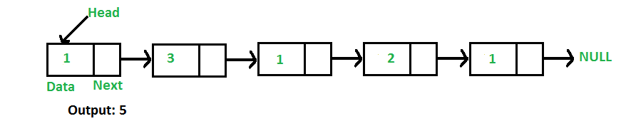

## 1. 问题描述

编写一个方法来计算给定单链表中的节点数。



例如，对于链表1->3->1->2->1，方法应返回5。

## 2. 迭代解法

```
int getCountUsingIterative()：
1. 将count初始化为0。
2. 初始化辅助节点指针，current = head。
3. current不为null时，执行以下操作
   a) current = current.next
   b) count++;
4. 返回count
```

下面是上述算法的具体实现，用于查找给定单链表中的节点数。

```java
public class LinkedList {

  public int getCountUsingIterative() {
    int count = 0;
    Node current = head;
    while (current != null) {
      // 自增count，并向前移动current指针
      count++;
      current = current.next;
    }
    return count;
  }
}
```

## 3. 递归解法

```
int getCountUsingRecursive(Node head)：
1. 如果head为null，返回0。
2. 否则返回 1 + getCountUsingRecursive(head.next) 
```

下面是上述算法的递归实现，用于查找给定单链表中的节点数。

```java
public class LinkedList {
  public int getCountUsingRecursive(Node head) {
    // 基准条件
    if (head == null)
      return 0;
    // 节点数为当前节点的个数加剩余节点的个数。
    return 1 + getCountUsingRecursive(head.next);
  }
}
```