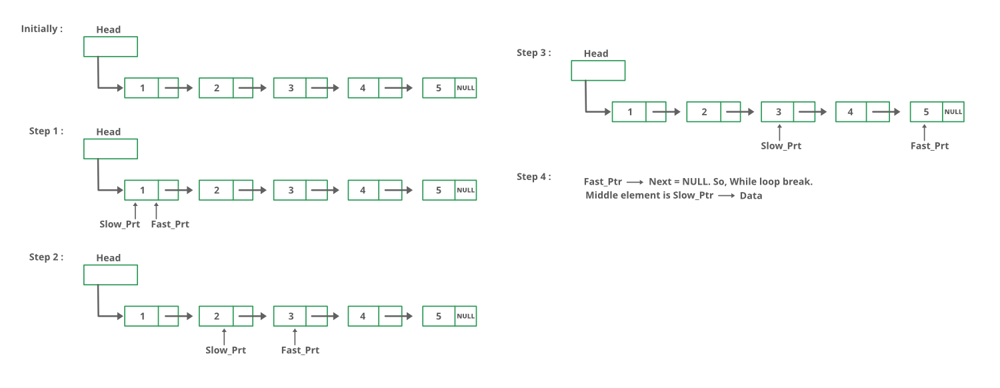

## 1. 问题描述

给定一个单链表，找到链表的中间节点。例如，如果给定的链表是1->2->3->4->5，则输出应该是3。如果有偶数个节点，
那么将有两个中间节点，我们需要返回第二个。例如，如果给定的链表是1->2->3->4->5->6，则输出应该是4。

## 2. 原始方法

遍历整个链表并计算节点的总个数，假设为count。然后再次遍历链表直到count / 2并返回count / 2处的节点值。

以下是具体实现：

```java
public class LinkedList {

  public int getMiddleNodeUsingRecursive(Node head) {
    int nodeCount = getCountUsingIterative(); // 获取节点的个数，见之前的具体实现
    Node current = head;
    int count = 0;
    // 遍历链表count / 2次.
    while (count < nodeCount / 2) {
      current = current.next;
      count++;
    }
    return current.data;
  }
}
```

## 3. 快慢指针

使用两个指针遍历链表。一个指针(慢指针)一次向前移动一个位置，另一个指针(快指针)一次向前移动两个位置。
当快指针到达链表末尾时，慢指针将位于链表的中间。

下图显示了快慢指针的处理过程：



以下为具体实现：

```java
public class LinkedList {

  public int getMiddleNodeUsingTwoPointer(Node head) {
    // 如果链表为空，返回-1
    if (head == null)
      return -1;
    // 初始化快慢指针，都指向头节点
    Node slowPointer = head;
    Node fastPointer = head;
    // 遍历链表，移动两个指针
    while (fastPointer != null && fastPointer.next != null) {
      fastPointer = fastPointer.next.next;
      slowPointer = slowPointer.next;
    }
    // 返回慢指针所指向节点的数据
    return slowPointer.data;
  }
}
```

## 4. 其他方法

将mid变量初始化为头节点，将count初始化为0。从头节点遍历链表，遍历的同时递增count，
并在count为奇数时更改mid=mid.next。因此，mid将只移动链表总长度的一半。

以下为上述思路的具体实现：

```java
public class LinkedList {

  public int getMiddleNodeUsingOtherMethod(Node head) {
    if (head == null)
      return -1;
    // 初始化mid指针
    Node mid = head;
    int count = 0;
    while (head != null) {
      // 当count为奇数时，向前移动mid指针
      if (count % 2 == 1)
        mid = mid.next;
      // 每次循环自增count，并移动head指针
      count++;
      head = head.next;
    }
    // 最后mid指向链表的中间节点，返回其元素值
    return mid.data;
  }
}
```