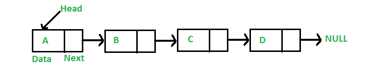

## 1. 问题描述

给定一个链表和数字n，编写一个方法，返回从链表末尾开始数的第n个节点的值。

例如，如果输入链表如下图所示且n=3，则输出为“B”。



## 2. 方法一(使用链表的长度)

```
1. 计算链表的长度，设长度为len。
2. 返回从链表开头的第(len – n + 1)个节点。
```

双指针概念：第一个指针用于存储变量的地址，第二个指针用于存储第一个指针的地址。如果我们希望通过函数更改变量的值，
我们将指针传递给它。如果我们想改变一个指针的值(即，它应该开始指向别的对象)，我们将指针传递给一个指针。

以下是上述方法的具体实现：

```java
public class LinkedList {

  public int getNthFromLast(int n) {
    int len = 0;
    Node temp = head;
    // 计算链表的节点个数
    while (temp != null) {
      len++;
      temp = temp.next;
    }
    // 如果n大于链表的长度，返回-1
    if (n > len)
      return -1;
    temp = head;
    // 获取从头节点开始的第(len- n + 1)个节点
    for (int i = 1; i < len - n + 1; i++)
      temp = temp.next;
    return temp.data;
  }
}
```

时间复杂度：O(n)，其中n是链表的长度。

## 3. 使用双指针

维护两个指针——引用指针和主指针，初始化两个指针指向头节点。首先，将引用指针从头节点移动n个节点。现在将两个指针一一移动，
直到引用指针到达末尾。现在主指针将指向从末尾开始的第n个节点。返回主指针的数据。

如下图所示：


以下是上述方法的具体实现：

```java
public class LinkedList {

  public int getNthFromLastUsingTwoPointer(int n) {
    // 初始化两个辅助指针指向头节点
    Node refPointer = head;
    Node mainPointer = head;
    int count = 0;
    if (head != null) {
      // 将refPointer指针移动到从头节点开始的第n个节点
      while (count < n) {
        if (refPointer == null)
          return -1;
        refPointer = refPointer.next;
        count++;
      }
      // 现在将两个指针同时向前移动一次，直到refPointer指针为null
      while (refPointer != null) {
        mainPointer = mainPointer.next;
        refPointer = refPointer.next;
      }
      // 返回mainPointer所指向节点的数据
      return mainPointer.data;
    }
    return -1;
  }
}
```

时间复杂度：O(n)，其中n是链表的长度。