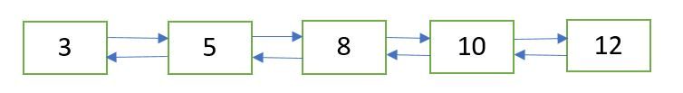
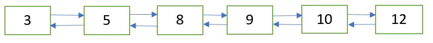

## 1. 问题描述

给定一个排序的双链表和一个要插入的值，编写一个函数以按排序的方式插入该值。

初始双链表：



插入9后的双链表：



## 2. 算法分析

让输入的双向链表按升序排序。

传递给函数的新节点包含数据部分中的数据，并且previous和next指针设置为null。

## 3. 算法实现

```java
public class InsertSortedDoublyLinkedList {
  DoublyLinkedList doublyLinkedList;
  Node head;

  public InsertSortedDoublyLinkedList(DoublyLinkedList doublyLinkedList) {
    this.doublyLinkedList = doublyLinkedList;
    head = doublyLinkedList.head;
  }

  public static Node sortedInsert(Node head, int newData) {
    // 创建新节点，将新节点的next和previous设置为null
    Node newNode = new Node(newData);
    newNode.next = newNode.previous = null;
    Node current;
    // 如果头节点为null，直接使新节点为头节点
    if (head == null)
      head = newNode;
      // 如果插入的新节点的数据小于头节点，使新节点成为头节点
    else if (head.data > newNode.data) {
      newNode.next = head;
      head.next.previous = newNode;
      head = newNode;
    } else {
      current = head;
      // 找到新节点的下一个节点
      while (current.next != null && current.next.data < newNode.data)
        current = current.next;
      // 使找到的节点成为新节点的next节点
      newNode.next = current.next;
      if (current.next != null)
        newNode.next.previous = newNode;
      current.next = newNode;
      newNode.previous = current;
    }
    return head;
  }
}
```

时间复杂度：O(n)