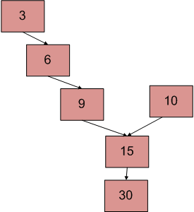

## 1. 问题描述

一个系统中有两个单链表。由于编程错误，其中一个链表的结束节点链接到第二个链表，形成了一个倒Y形链表。编写一个程序来获取两个链表合并的点。



上图显示了一个以15为交点的两个链表的示例。

## 2. 使用两个循环

使用2个嵌套的for循环。外循环将针对第一个链表的每个节点，内循环将针对第二个链表。在内循环中，
检查第二个链表的任何节点是否与第一个链表的当前节点相同。此方法的时间复杂度为O(M  N)，其中m和n是两个链表中的节点数。

## 3. 标记已访问的节点

该方法需要修改基本的链表数据结构。每个节点都有一个visited标志。遍历第一个链表并不断标记访问过的节点。
现在遍历第二个链表，如果再次看到访问过的节点，则有一个交点，返回相交的节点。此解决方案时间复杂度为O(m+n)，但需要每个节点的附加信息。
不需要修改基本数据结构的该解决方案的变体可以使用哈希来实现。遍历第一个链表，并将访问节点存储在HashSet中。现在遍历第二个链表，如果看到HashSet中已经存在的节点，则返回相交节点。

## 4. 使用节点数的不同

1. 获取第1个链表中节点的count，让count为c1。
2. 获取第2个链表中节点的count，让count为c2。
3. 获得count差d = abs(c1–c2)。
4. 遍历节点数更大链表的第一个节点到第d个节点。现在两个链表的节点数相等。
5. 然后我们可以并行遍历这两个链表，直到遇到一个公共节点。(请注意，通过比较节点的地址可以获得公共节点)

如下图所示：


以下是上述方法的具体实现：

```java
public class InterSectionPoint {
  LinkedList linkedList;
  Node head;

  public InterSectionPoint(LinkedList linkedList) {
    this.linkedList = linkedList;
    head = linkedList.head;
  }

  public static int getNode(Node head1, Node head2) {
    int c1 = getCount(head1);
    int c2 = getCount(head2);
    int d;
    if (c1 < c2) {
      d = c2 - c1;
      return getInterSectionNode(head1, head2, d);
    } else {
      d = c1 - c2;
      return getInterSectionNode(head2, head1, d);
    }
  }

  private static int getInterSectionNode(Node head1, Node head2, int d) {
    Node temp1 = head2;
    Node temp2 = head1;
    int count = 0;
    while (count < d) {
      count++;
      temp1 = temp1.next;
    }
    while (temp1 != null && temp2 != null) {
      if (temp1.data == temp2.data)
        return temp1.data;
      temp1 = temp1.next;
      temp2 = temp2.next;
    }
    return -1;
  }

  private static int getCount(Node head) {
    Node current = head;
    int count = 0;
    while (current != null) {
      count++;
      current = current.next;
    }
    return count;
  }
}
```

时间复杂度：O(m+n)

辅助空间：O(1)

## 5. 在第一个链表中制造环

1. 遍历第一个链表(计算元素)并制造一个循环链表。(记住最后一个节点，以便我们后面可以打破环)。
2. 现在将问题视为在第二个链表中查找环，所以问题解决了。
3. 由于我们已经知道环的长度(第一个链表的大小)，我们可以遍历第二个链表中的许多节点，然后从第二个链表的开头开始另一个指针。我们必须遍历，直到它们相等，这就是所需的交点。
4. 从链表中删除环。

时间复杂度：O(m+n)

辅助空间：O(1)

## 5. 反转第一个链表并建立方程式

```
1. 设X为第一个链表到交点的长度。
   设Y为第二个链表到交点的长度。
   设Z为链表从交点到包含交点节点链表的长度。
因此
  X + Z = C1;
  Y + Z = C2;
2. 反转第一个链表。
3. 遍历第二个链表。令C3为第二个链表的长度 - 1。
因此
  X + Y = C3
  
```