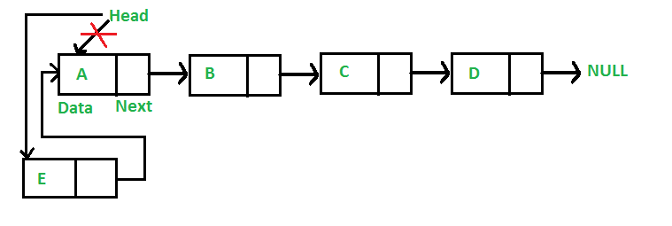
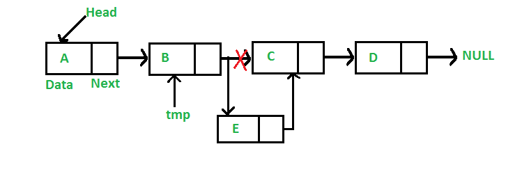
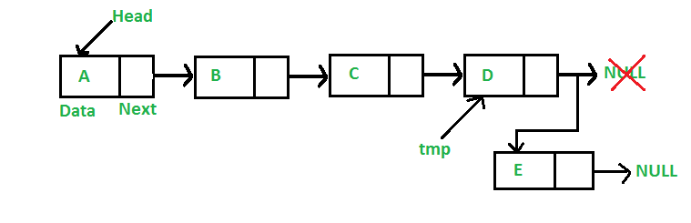
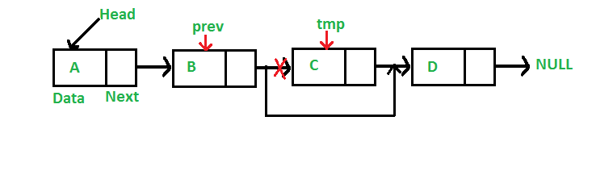

## 1. 概述

与数组一样，链表也是一种线性数据结构。与数组不同的是，链表元素不存储在相邻的位置；元素使用指针链接。


## 2. 链表的优势

数组可用于存储相似类型的线性数据，但数组有以下限制。

1. 数组的大小是固定的：因此我们必须提前知道元素数量的上限。此外，通常无论使用情况如何，分配的内存都等于上限。
2. 在数组中插入新元素的成本很高，因为我们需要为新元素提供位置，必须移动现有数组的元素。
   但在链表中如果有头节点，则可以通过它遍历到任何节点，并在所需位置插入新节点。

例如，如果我们在数组ids[]中维护id的排序列表。ids[]=[1000, 1010, 1050, 2000, 2040]。

如果我们想插入一个新的id 1005，那么为了保持排序顺序，我们必须向右移动1000以后的所有元素(不包括1000)。

除非使用一些特殊技术，否则删除数组元素的代价也很高。例如，要删除id[]中的1010，必须向前移动1010之后的所有元素，这会影响代码的效率。

与数组相比的优势：

1. 动态大小
2. 方便插入/删除

缺点：

1. 不允许随机访问。我们必须从第一个节点(头节点)开始按顺序访问元素。因此，我们无法使用链表的默认实现高效地进行二分搜索。
2. 链表中的每个元素都需要为指针提供额外的内存空间。
3. 对缓存不友好。由于数组元素是连续的位置，因此存在空间局部性，而在链表的情况下则不存在。

## 3. 链表实现

链表由指向链表第一个节点的指针表示。第一个节点称为头(head)节点。如果链表为空，则head节点将指向null。

链表中的每个节点至少由两部分组成：

1. 数据(我们可以存储整数、字符串或任何类型的数据)。
2. 指向下一个节点的引用或指针(将一个节点链接到另一个节点)。

在Java中，链表可以表示为类，节点可以表示为单独的节点类。链表类包含节点类类型的引用。

```java

class LinkedList {
    Node head; // 链表的头节点

    // 链表节点类
    class Node {
        int data;
        Node next;

        // 构造一个新的节点，其next指针初始化指向null
        Node(int d) {
            data = d;
        }
    }
}
```

让我们创建一个包含3个节点的简单链表：

```java
public class LinkedList {
    public Node head;

    // 链表节点。这个内部类是静态的，因此main()方法可以访问它
    static class Node {
        int data;
        Node next;

        public Node(int d) {
            data = d;
            next = null;
        }
    }
}

public class LinkedListUnitTest {

    @Test
    void whenCreateLinkedListWithThreeElement_thenSuccess() {
        // 从空链表开始
        LinkedList linkedList = new LinkedList();
        linkedList.head = new LinkedList.Node(1);
        LinkedList.Node second = new LinkedList.Node(2);
        LinkedList.Node third = new LinkedList.Node(3);
    /
        动态分配三个节点，我们将这三个节点分别作为头节点，第二个，和第三个节点。
          llist.head        second             third
             |                |                  |
             |                |                  |
         +----+------+     +----+------+     +----+------+
         | 1  | null |     | 2  | null |     |  3 | null |
         +----+------+     +----+------+     +----+------+
     /
        linkedList.head.next = second; // 将第一个节点(头节点)链接到第二个节点
    
    /
        现在，第一个节点的下一个节点指向的是第二个节点。所以他们两者之间是链接的。
        
         llist.head        second              third
            |                |                  |
            |                |                  |
        +----+------+     +----+------+     +----+------+
        | 1  |  o-------->| 2  | null |     |  3 | null |
        +----+------+     +----+------+     +----+------+
     /
        second.next = third; // 将第二个节点链接到第三个节点
    
    /
        现在，第二个节点的下一个节点指向的是第三个节点。所以这三个节点已链接。
        
          llist.head        second              third
            |                |                  |
            |                |                  |
        +----+------+     +----+------+     +----+------+
        | 1  |  o-------->| 2  |  o-------->|  3 | null |
        +----+------+     +----+------+     +----+------+
     /
    }
}
```

## 4. 链表遍历

在前面的程序中，我们创建了一个包含三个节点的简单链表。让我们遍历创建的链表并打印每个节点的数据。
对于遍历，让我们编写一个printList()方法，用于打印任何给定的链表。

```java
public class LinkedList {

    public void printList(Node head) {
        // 使用一个辅助指针，默认指向头节点
        Node current = head;
        // 遍历链表
        while (current != null) {
            // 打印数据，并向前移动current指针
            System.out.print(current.data + " ");
            current = current.next;
        }
    }
}
```

## 5. 添加节点

一般来说，可以通过三种方式添加新节点。

1. 在链表的前面
2. 在给定节点之后
3. 在链表的末尾

### 5.1 在前面添加一个节点(4步流程)

新节点始终添加在给定链表的头节点之前。新添加的节点成为链表的新头节点。例如，如果给定的链表是10->15->20->25，
并且我们在头节点前面添加了一个元素5，那么链表将变成5->10->15->20->25。
假设向头节点之前添加新节点的方法为push()。push()必须接收指向头节点的指针，因为push()必须更改头节点以指向新节点。



以下是在前面添加节点的4个步骤。

```java
public class LinkedList {

    public void push(int newData) {
        // 1和2: 创建节点&分配数据
        Node newNode = new Node(newData);
        // 3: 使原来的头节点成为新节点的下一个节点
        newNode.next = head;
        // 4: 使新节点成为新的头节点
        head = newNode;
    }
}
```

push()的时间复杂度为O(1)，因为它的处理时间是恒定的。

### 5.2 在给定节点后添加节点(5步流程)

给定一个指向某个节点的指针，新节点插入到给定节点之后。



```java
public class LinkedList {

    // 在给定的preNode节点之后插入新节点。
    public void insertAfter(Node preNode, int newData) {
        // 1. 检查给定节点是否为null
        if (preNode == null)
            return;
        // 2&3. 创建节点，分配数据
        Node newNode = new Node(newData);
        // 4. 将preNode的下一个节点作为新节点的下一个节点
        newNode.next = preNode.next;
        // 5. 将新节点作为给定节点preNode的下一个节点
        preNode.next = newNode;
    }
}
```

insertAfter()的时间复杂度为O(1)，因为它的处理时间是恒定的。

### 5.3 在末尾添加一个节点(6步流程)

新节点始终添加在给定链表的最后一个节点之后。例如，如果给定的链表是5->10->15->20->25，并且我们在末尾添加了一个元素30，
那么链表将变成5->10->15->20->25->30。由于链表通常由其头节点表示，因此我们必须遍历该链表直到最后，
然后将新节点设置为最后一个节点的下一个节点。



下面是在末尾添加节点的6个步骤。

```java
public class LinkedList {

    // 在末尾添加一个新节点
    public void append(int newData) {
  / 1. 创建新节点
     2. 分配值
     3. 设置新节点的下一个节点为null(构造新节点时默认设置)
   /
        Node newNode = new Node(newData);
        // 4. 如果链表为空，则将新节点作为头节点
        if (head == null) {
            head = new Node(newData);
            return;
        }
        // 4. 这个新节点将是最后一个节点，因此将下一个设置为null
        newNode.next = null;
        // 5. 遍历到最后一个节点
        Node last = head;
        while (last.next != null)
            last = last.next;
        // 6. 将新节点设置为原始链表最后一个节点的下一个节点
        last.next = newNode;
    }
}
```

append()的时间复杂度为O(n)，其中n是链表中的节点数。由于自始至终都有一个循环，因此该方法执行O(n)遍历。

通过保持一个指向链表尾部的额外指针，可以将该方法优化为O(1)复杂度。

## 6. 删除节点

给定一个key，删除该key在链表中的第一次出现的节点。

迭代方法：

要从链表中删除节点，我们需要执行以下步骤。

1. 找到要删除的节点的上一个节点，假设为previous。
2. 更改previous节点的下一个节点为被删除节点的下一个节点。
3. 释放要删除的节点的内存(在Java中并不需要手动释放内存，因此这一步不需要)。



```java
public class LinkedList {

    // 给定一个key，删除key在链表中第一个出现的节点
    public void delete(int key) {
        // 1. 初始化一个辅助指针，指向头节点
        Node temp = head;
        // 2. 初始化头节点的前一个节点为null，因此初始化previous指针为null
        Node previous = null;
        // 3. 如果要删除的节点本身为头节点
        if (temp != null && temp.data == key) {
            head = temp.next; // 将头节点的下一个节点设置为链表的新头节点
            return;
        }
        // 4. 搜索要删除的key，同时记录previous节点
        while (temp != null && temp.data != key) {
            previous = temp;
            temp = temp.next;
        }
        // 5. 如果上述while循环遍历完temp为null，则链表中不存在包含key的节点
        if (temp == null)
            return;
        // 6. 否则，更改previous节点的下一个节点为被删除节点的下一个节点
        previous.next = temp.next;
    }
}
```

## 7. 删除给定位置的节点

给定一个链表和一个position，删除给定位置的链表节点。

示例：

```
输入: position = 1, 链表 = 8->2->3->1->7
输出: 链表 = 8->3->1->7

暑入: position = 0, 链表 = 8->2->3->1->7
输出: 链表 = 2->3->1->7
```

如果要删除的节点是头节点，只需简单将其删除即可。如果要删除中间位置的节点，我们必须有一个指向被删除节点的前一个节点的指针previous。
因此，如果position不为0，我们运行一个(position - 1)次的循环，得到一个指向被删除节点的前一个节点的指针。

以下是具体实现：

```java
public class LinkedList {

    // 删除给定位置处的节点
    public void deleteNode(int position) {
        if (head == null) // 如果链表为空
            return;
        Node temp = head; // 初始化辅助指针
        if (position == 0) { // 如果需要删除的是头节点
            head = temp.next; // 将原始链表头节点的下一个节点设置为新的头节点
            return;
        }
        // 找到要删除节点的上一个节点
        for (int i = 0; temp != null && i < position - 1; i++)
            temp = temp.next;
        if (temp == null || temp.next == null) // 如果position大于节点总数
            return;
        temp.next = temp.next.next; // temp.next是要被删除的节点，因此设置被删除节点的上一个节点为被删除节点的下一个节点
    }
}
```

复杂度分析：

+ 最佳情况：如果给定的position为1，则为O(1)。
+ 平均和最坏情况：如果给定的位置为size-1，则需要一直遍历直到找不到position为止。
+ 空间复杂度：O(1)，不需要额外的空间。