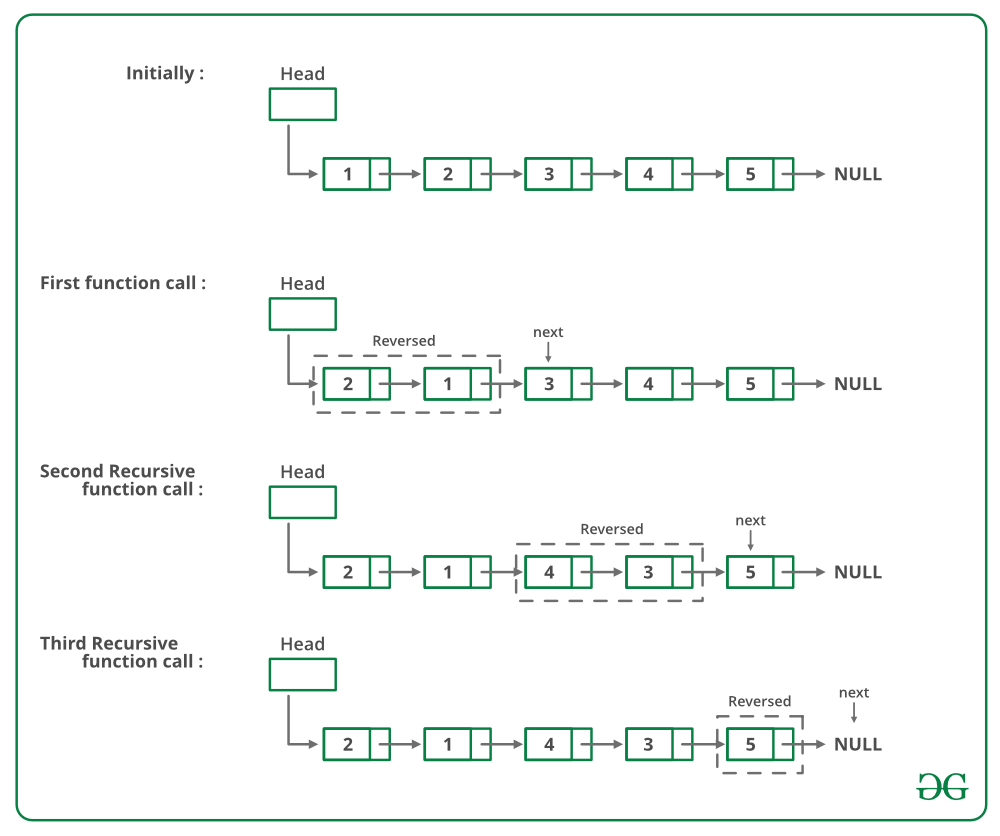

## 1. 问题描述

给定一个单链表，编写一个函数来成对交换元素。

示例：

```
输入: 1->2->3->4->5->6->NULL 
输出: 2->1->4->3->6->5->NULL

输入: 1->2->3->4->5->NULL 
输出: 2->1->4->3->5->NULL

输入: 1->NULL 
输出: 1->NULL 
```

例如，如果链表为1->2->3->4->5，则函数应将其更改为2->1->4->3->5。

## 2. 迭代实现

从头节点开始，遍历链表。在遍历每个节点时与下一个节点交换数据。

以下是上述方法的具体实现：

```
public void pairWiseSwapUsingIterative(Node head) {
  Node current = head;
  while (current != null && current.next != null) {
    int k = current.data;
    current.data = current.next.data;
    current.next.data = k;
    current = current.next.next;
  }
}
```

时间复杂度：O(n)

## 3. 递归实现

如果链表中有2个或2个以上的节点，则交换前两个节点并递归调用链表的其余部分。

如下图所示：



以下是上述方法的具体实现：

```
public void pairWiseSwapUsingRecursive(Node head) {
  if (head == null || head.next == null)
    return;
  int k = head.data;
  head.data = head.next.data;
  head.next.data = k;
  pairWiseSwapUsingRecursive(head.next.next);
}
```

时间复杂度：O(n)