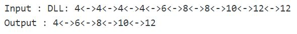

## 1. 问题描述

给定一个包含n个节点的已排序双链表。问题是从给定链表中删除重复节点。

示例：



## 2. 算法分析

```
removeDuplicates(head_ref, x)
      if head_ref == NULL
          return
      Initialize current = head_ref
      while current->next != NULL
           if current->data == current->next->data
               deleteNode(head_ref, current->next)
           else
               current = current->next
```

## 3. 算法实现

```java
public class RemoveDuplicate {
  DoublyLinkedList doublyLinkedList;
  Node head;

  public RemoveDuplicate(DoublyLinkedList doublyLinkedList) {
    this.doublyLinkedList = doublyLinkedList;
    head = doublyLinkedList.head;
  }

  public void removeDuplicates(Node head) {
    // 如果头节点为null，直接return
    if (head == null)
      return;
    Node current = head;
    // 遍历链表
    while (current.next != null) {
      // 如果当前节点与当前节点的下一个节点元素相同，则存在重复，删除当前节点的下一个节点
      if (current.data == current.next.data)
        doublyLinkedList.deleteNode(current.next);
      // 如果不相同，右移当前节点
      else
        current = current.next;
    }
  }
}
```

时间复杂度：O(n)