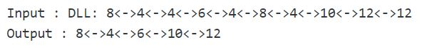

## 1. 问题描述

给定一个包含n个节点的未排序双链表。问题是要从给定链表中删除重复节点。

示例：



## 2. 简单方法实现

这是使用两个循环的最简单方法。外循环用于逐个获取元素，内循环将获取的元素与其余元素进行比较。

```java
public class RemoveDuplicate {
  DoublyLinkedList doublyLinkedList;
  Node head;

  public RemoveDuplicate(DoublyLinkedList doublyLinkedList) {
    this.doublyLinkedList = doublyLinkedList;
    head = doublyLinkedList.head;
  }

  public Node removeDuplicatesInUnsortListUsingLoop(Node head) {
    // 如果链表为null或仅包含一个节点，直接返回头节点
    if (head == null || head.next == null)
      return head;
    Node first, second;
    // 逐个遍历节点
    for (first = head; first != null; first = first.next) {
      second = first.next;
      // 将遍历的节点与剩余节点的元素进行比较
      while (second != null) {
        // 如果元素相等
        if (first.data == second.data) {
          // 先获取下一个节点
          Node next = second.next;
          // 删除当前节点
          doublyLinkedList.deleteNode(second);
          // 更新当前节点
          second = next;
        } else // 否则元素不相等，右移second节点
          second = second.next;
      }
    }
    return head;
  }
}
```

时间复杂度：O(n<sup>2</sup>)

辅助空间：O(1)

## 3. 哈希

从头到尾遍历双链表。对于每个新遇到的元素，我们检查它是否在哈希表中：如果是，我们删除它；否则，我们将其放入哈希表中。Java中使用HashSet来实现。

```java
public class RemoveDuplicate {
  DoublyLinkedList doublyLinkedList;
  Node head;

  public RemoveDuplicate(DoublyLinkedList doublyLinkedList) {
    this.doublyLinkedList = doublyLinkedList;
    head = doublyLinkedList.head;
  }

  public Node removeDuplicatesInUnsortListUsingHash(Node head) {
    // 如果头节点为null，直接返回null。
    if (head == null)
      return null;
    // 初始化HashSet，用于存储节点元素
    HashSet<Integer> nodes = new HashSet<>();
    Node current = head, next;
    // 遍历链表
    while (current != null) {
      // 如果当前节点的元素存在于HashSet中
      if (nodes.contains(current.data)) {
        // 先获取当前节点的下一个节点
        next = current.next;
        // 删除当前节点
        doublyLinkedList.deleteNode(current);
        // 更新当前节点为下一个节点
        current = next;
      } else {
        // 如果当前节点的元素不存在于HashSet中，则添加。
        nodes.add(current.data);
        // 右移当前节点
        current = current.next;
      }
    }
    return head;
  }
}
```

时间复杂度：O(n)

辅助空间：O(n)