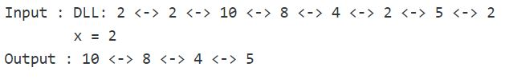

## 1. 问题描述

给定一个双向链表和一个key x。问题是从双向链表中删除所有元素为x的节点。

示例：



## 2. 算法实现

```java
public class RemoveKey {
  DoublyLinkedList doublyLinkedList;
  Node head;

  public RemoveKey(DoublyLinkedList doublyLinkedList) {
    this.doublyLinkedList = doublyLinkedList;
    head = doublyLinkedList.head;
  }

  public Node deleteAllOccurOfX(Node head, int x) {
    // 如果头节点为null，直接返回null
    if (head == null)
      return null;
    Node current = head;
    Node next;
    // 遍历链表
    while (current != null) {
      // 如果当前节点元素等于x
      if (current.data == x) {
        // 获取当前节点的下一个节点
        next = current.next;
        // 删除当前节点
        doublyLinkedList.deleteNode(current);
        // 更新当前节点为下一个节点
        current = next;
      } else // 如果当前节点元素不等于x，右移当前节点
        current = current.next;
    }
    return head;
  }
}
```

时间复杂度：O(n)