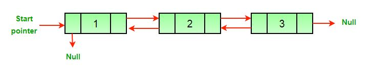
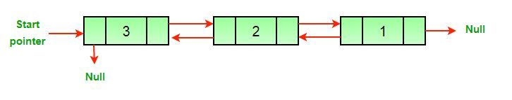

## 1. 问题描述

给定一个双链表，目标是反转给定的双链表。

原始双链表为：



反转后的双链表为：



## 2. 算法实现

下面是一个反转双链表的简单方法。我们所需要做的就是对所有节点交换previous和next指针，更改头节点的previous指针，并在最后更改头指针。

```java
public class DoublyLinkedList {

  public void reverse() {
    Node temp = null;
    Node current = head;
    // 交换双链表所有节点的next和previous指针
    while (current != null) {
      temp = current.previous;
      current.previous = current.next;
      current.next = temp;
      current = current.previous;
    }
    // 在更改头节点之前，检查链表是否为null或者只有节点的链表
    if (temp != null)
      head = temp.previous;
  }
}
```

时间复杂度：O(N)，其中N表示双链表中的节点数。

辅助空间：O(1)

我们还可以交换数据而不是指针来反转双向链表。用于反转数组的方法可用于交换数据。如果数据项的大小更大，则与指针相比，交换数据的成本可能更高。

## 3. 使用栈实现

同样的问题也可以通过使用栈来解决。

步骤：

1. 将所有节点的数据push到栈中 -> O(n)
2. 然后pop元素并更新双向链表

时间复杂度：O(n)

辅助空间：O(n)

在这种方法中，我们遍历一次链表并向栈中添加元素，然后再次遍历整个链表以更新所有元素。整个过程需要2n个时间，这是O(n)的时间复杂度。