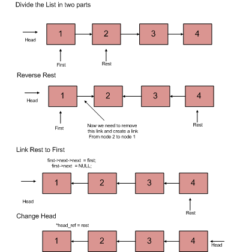

## 1. 问题描述

给定指向链表头部节点的指针，反转链表。我们需要通过更改节点之间的链接来反转链表。

示例：

```
输入: 1->2->3->4->NULL 
输出: 4->3->2->1->NULL

输入: 1->2->3->4->5->NULL 
输出: 5->4->3->2->1->NULL

输入: NULL 
输出: NULL

输入: 1->NULL 
输出: 1->NULL 
```

## 2. 迭代法

```
1. 初始化3个指针，previous = null，current = head，next = null。
2. 遍历链表。在循环中，执行以下操作。
   // 更改current的next之前
   // 保存next节点
   next = current.next
   // 现在更改current的next
   // 这就是实际反转的地方
   current.next = previous
   // 将previous和current向前移动一次
   previous = current;
   current = next;
```


以下是上述方法的具体实现：

```
public Node reverseUsingIterative(Node head) {
  Node current = head;
  Node previous = null;
  Node next;
  while (current != null) {
    next = current.next;
    current.next = previous;
    previous = current;
    current = next;
  }
  return previous;
}
```

时间复杂度：O(n)

空间复杂度：O(1)

## 3. 递归实现

```
1. 将链表分为两部分-第一个节点和链表的其余部分
2. 对链表的其余部分调用reverse
3. 将rest链接到第一个
4. 固定头指针
```



以下为具体实现：

```
public Node reverseUsingRecursive(Node head) {
  if (head == null || head.next == null) {
    return head;
  }
  Node temp = reverseUsingRecursive(head.next);
  head.next.next = head;
  head.next = null;
  return temp;
}
```

时间复杂度：O(n)

空间复杂度：O(1)

## 4. 一种简单的尾部递归方法

下面是此方法的实现。

```
public Node reverseUtilRecursive(Node current, Node previous) {
  if (head == null)
    return head;
  if (current.next == null) {
    head = current;
    current.next = previous;
    return head;
  }
  Node next = current.next;
  current.next = previous;
  reverseUtilRecursive(next, current);
  return head;
}
```

## 5. 使用栈

```
1. 将节点存储在栈中，直到输入所有值。
2. 完成所有输入后，将头指针更新到最后一个位置(即最后一个值)。
3. 开始弹出节点，并以相同的顺序存储它们，直到栈为空。
4. 将栈中最后一个节点的下一个指针更新为NULL。
```

以下是上述方法的具体实现：

```
public Node reverseUsingStack(Node head) {
  Node current = head;
  Stack<Node> nodes = new Stack<>();
  while (current.next != null) {
    nodes.push(current);
    current = current.next;
  }
  head = current;
  while (!nodes.isEmpty()) {
    current.next = nodes.peek();
    nodes.pop();
    current = current.next;
  }
  current.next = null;
  return head;
}
```

## 6. 使用数组

```
1. 创建链表
2. 计算链表中存在的节点数count
3. 使用count的大小初始化数组
4. 将链表的元素存储在数组中
5. 打印数组的最后一个索引到第一个索引。
```