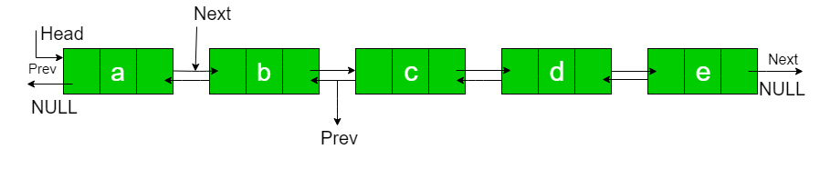
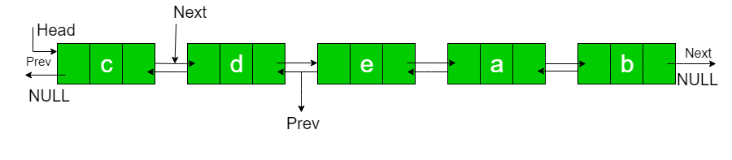

## 1. 问题描述

给定一个双链表，将链表逆时针旋转N个节点。这里N是一个给定的正整数，小于链表中的节点数。



假设N=2，旋转后的链表为：



示例：

```
输入: a  b  c  d  e   N = 2
输出: c  d  e  a  b 

输入: a  b  c  d  e  f  g  h   N = 4
输出: e  f  g  h  a  b  c  d 
```

## 2. 算法分析

1. 要旋转双链表，首先，我们需要遍历链表并找到最后一个节点。
2. 然后使它成为一个循环链表。
3. 然后将head和temp移动n个节点。
4. 然后将链表重新改为非循环链表。

## 3. 算法实现

```java
public class RotateDoublyLinkedList {
  DoublyLinkedList doublyLinkedList;
  Node head;

  public RotateDoublyLinkedList(DoublyLinkedList doublyLinkedList) {
    this.doublyLinkedList = doublyLinkedList;
    head = doublyLinkedList.head;
  }

  public void rotate(int n) {
    // 如果n = 0，不需要旋转，直接return
    if (n == 0)
      return;
    Node current = head;
    int count = 1;
    // 获取第n个节点
    while (current != null && count < n) {
      count++;
      current = current.next;
    }
    if (current == null)
      return;
    // 保存第n个节点的引用
    Node nthNode = current;
    // 获取最后一个节点
    while (current.next != null)
      current = current.next;
    // 将头节点设置为最后一个节点的下一个节点，将最后一个节点设置为头节点的上一个节点，形成循环链表
    current.next = head;
    head.previous = current;
    // 将第n个节点的下一个节点设置为新的头节点
    head = nthNode.next;
    // 接触循环链表的引用
    head.previous = null;
    nthNode.next = null;
  }
}
```

时间复杂度：O(N)

空间复杂度：O(1)