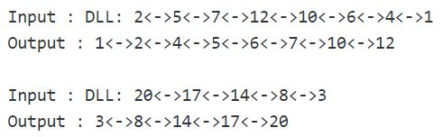

## 1. 问题描述

对给定的biotonic双向链表进行排序。biotonic双链表是一个先递增后递减的双向链表。严格递增或严格递减的链表也是仿生双向链表。

示例：

## 2. 算法实现

找到链表中小于其上一个节点的第一个节点。将它设置为current。如果不存在此类节点，则链表已排序。
否则，将链表拆分为两个链表，第一个链表从head节点开始，直到current节点的前一个节点，第二个从current节点开始，直到链表的末尾。
反转第二个双链接链表。现在合并第一个和第二个排序的双链接链表。