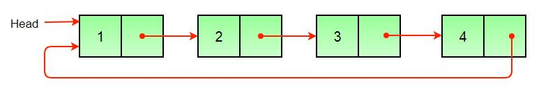
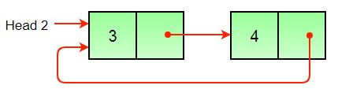

## 1. 问题描述

原始链表：



结果链表1：



结果链表2：


如果节点个数为奇数，则第一个链表应包含一个额外的节点。

## 2. 算法实现

1. 使用双指针存储循环链表的mid指针和last指针。
2. 将链表的第二部分更改为环形。
3. 将链表的第一部分更改为环形。
4. 设置两个链表的头指针。

在下面的实现中，如果给定的循环链表中有奇数个节点，则第一个结果链表比第二个结果链表多1个节点。

```java
public class SplitTwoHalves {
  static Node head, head1, head2;

  void splitList() {
    Node slowPointer = head;
    Node fastPointer = head;
    if (head == null)
      return;
    // 如果循环链表中有奇数节点，则fastPointer.next会在某个时间点变为头节点
    // 对于偶数个节点，fastPointer.next.next会在某个时间点变为头节点
    while (fastPointer.next != head && fastPointer.next.next != head) {
      slowPointer = slowPointer.next;
      fastPointer = fastPointer.next.next;
    }
    // 如果链表中的节点为偶数，则经过以上while循环后，fastPointer指向倒数第二个节点，因此将fastPointer向前移动一次到最后一个节点
    if (fastPointer.next.next == head)
      fastPointer = fastPointer.next;
    // 设置左半部分的头节点
    head1 = head;
    // 设置右半部分的头节点
    if (head.next != head)
      head2 = slowPointer.next;
    // 将左右两部分链表分别修改为循环链表
    fastPointer.next = slowPointer.next;
    slowPointer.next = head;
  }
}
```

时间复杂度：O(n)。