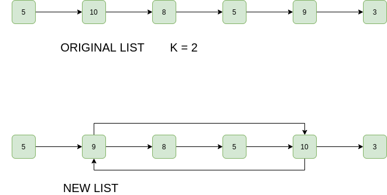

## 1. 问题描述

给定一个单链表，从开始的第k个节点与从结束的第 k 个节点交换。不允许交换数据，只能更改指针。
在链表数据部分很大的许多情况下(例如学生的详细信息包括name、no、address等)，此要求可能是合乎逻辑的。
指针始终是固定的(大多数编译器为4个字节)。

示例：

```
输入: 1 -> 2 -> 3 -> 4 -> 5
     K = 2
输出: 1 -> 4 -> 3 -> 2 -> 5 
解释: 从前面和后面开始的第2个节点分别为2和4，因此交换它们


输入: 1 -> 2 -> 3 -> 4 -> 5
     K = 5
输出: 5 -> 2 -> 3 -> 4 -> 1 
解释: 从前面和后面开始的第5个节点分别为5和1，因此交换它们
```



## 2. 算法分析

想法很简单，找到从头开始第k个节点，而从最后开始的第k个节点是从头开始的第n-k+1个节点。交换两个节点。但是有一些极端情况，必须处理。

1. Y在X旁边
2. X在Y旁边
3. X和Y相同
4. X和Y不存在(k大于链表中的节点数)

以下是上述算法的具体实现：

```java
public class SwapKthNode {
  LinkedList linkedList;
  Node head;

  public SwapKthNode(LinkedList linkedList) {
    this.linkedList = linkedList;
    head = linkedList.head;
  }

  // 计算链表的长度
  public int countNodes() {
    int count = 0;
    Node current = head;
    while (current != null) {
      count++;
      current = current.next;
    }
    return count;
  }

  public void swapKth(int k) {
    // 计算链表的长度
    int n = countNodes();
    // 检查给定的k是否有效，并且检查从开头和结尾数的第k个节点是否是同一个节点
    if (k > n || 2  k - 1 == n)
      return;
    // 找到从头开始的第k个节点及它的前一个节点，因为我们需要更改前一个节点的next指针
    Node x = head;
    Node preX = null;
    for (int i = 1; i < k; i++) {
      preX = x;
      x = x.next;
    }
    // 找到从尾开始的第k个节点及它的前一个节点，因为我们需要更改前一个节点的next指针
    Node y = head;
    Node preY = null;
    for (int i = 1; i < n - k + 1; i++) {
      preY = y;
      y = y.next;
    }
    /
     如果preX存在，则它新的下一个节点为y。
     考虑y.next为x的情况(例如链表为1->2->3->4，k = 3)，在这种情况下，preX和y相同。所以语句“preX.next = y”创建了一个自循环。
     当我们更改y.next时，这个自循环将被打破。
     /
    if (preX != null)
      preX.next = y;
    // 同理，preY也是如此
    if (preY != null)
      preY.next = x;
    // 交换x和y的next指针。如果x.next是y或y.next是x，这些语句也会打破自循环。
    Node temp = x.next;
    x.next = y.next;
    y.next = temp;
    // 当k为1或n时更改头指针
    if (k == 1)
      head = y;
    if (k == n)
      head = x;
  }
}
```

时间复杂度：O(n)，其中n是链表的长度，需要遍历一次链表。

辅助空间：O(1)，不需要额外空间。

请注意，上面的代码运行3个单独的循环来计算节点总数，找到x和preX，以及找到y和preY。这三件事可以在一个循环中完成。这里使用3个单独的循环为了保证直观。