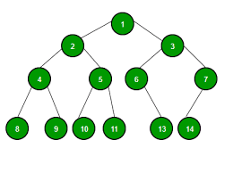

## 1. 为什么需要树结构？



与线性数据结构的数组和链表不同，树是层次(或非线性)数据结构。

+ 使用树的一个原因可能是因为你想要存储自然形成层次结构的信息。例如计算机上的文件系统：

```
        /   <-- root
    /       
...         home
        /        
     ugrad     course
    /        /    |    
  ...      cs101 cs112 cs113
```

如果我们以树的形式组织元素(具有某种顺序，例如BST)，我们可以在适当的时间内搜索给定的元素(比链表快，比数组慢)。
像AVL和红黑树这样的自平衡搜索树保证了O(Logn)的搜索时间上限。

我们可以在适当的时间内插入/删除元素(比数组快，比无序链表慢)。像AVL和红黑树这样的自平衡搜索树保证了插入/删除的O(Logn)时间上限。

与链表一样，树的指针实现对节点数没有上限，因为节点是使用指针链接的。

## 2. 其他应用

1. 存储分层数据，如文件结构、组织结构、XML/HTML数据。
2. 二叉搜索树是一种允许对已排序数据进行快速搜索、插入、删除的树。它还允许找到最近的元素。
3. 堆是一种使用数组实现的树数据结构，用于实现优先级队列。
4. B- Tree和B+ Tree用于在数据库中实现索引。
5. 语法树用于编译器设计中的扫描、解析、代码生成和计算算术表达式。
6. K-D树是一种空间分区树，用于组织K维空间中的点。
7. Trie用于实现具有前缀查找的词典。
8. 后缀树用于在固定文本中进行快速模式搜索。
9. 生成树和最短路径树分别用于计算机网络中的路由器和网桥。
10. 作为合成数字图像以获得视觉效果的工作流。
11. 决策树。
12. 大型组织的组织结构图。
