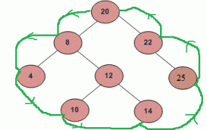

## 1. 问题描述

给定一棵二叉树，从根节点开始逆时针打印二叉树的边界节点。边界依次包括左边界、叶子和右边界，没有重复节点。(节点的值可能仍然是重复的)。

左边界定义为从根节点到最左侧节点的路径。

右边界定义为从根节点到最右侧节点的路径。

如果根节点没有左子树或右子树，那么根节点本身就是左边界或右边界。请注意，此定义仅适用于二叉树，不适用于任何子树。

最左边的节点定义为当你总是首先移动到左子树(如果存在)时可以到达的叶节点。如果不是，则转到右侧子树。重复此操作，直到到达叶节点。

最右侧的节点也以相同的方式定义，左侧和右侧交换。

例如，以下树的边界遍历为“20 8 4 10 14 25 22”



## 2. 算法分析

我们将问题分为三部分：

1. 以自顶向下的方式打印左边界。
2. 从左到右打印所有叶节点，可以再次细分为两个子部分：
    1. 从左到右打印左子树的所有叶节点。
    2. 从左到右打印右子树的所有叶节点。
3. 以自下而上的方式打印右边界。

我们需要注意一件事，即节点不应该多次打印。例如最左边的节点也是树的叶子节点。

## 3. 算法实现

基于上述分析，以下是具体的实现：

```java
public class BoundaryTraversal {
  Node root;

  public BoundaryTraversal(Node root) {
    this.root = root;
  }

  public void printBoundary(Node root) {
    if (root == null)
      return;
    System.out.print(root.key + " ");
    printBoundaryLeft(root.left);
    printLeaves(root.left);
    printLeaves(root.right);
    printBoundaryRight(root.right);
  }

  // 打印所有左边界节点，叶节点除外。以自顶向下方式打印节点
  private void printBoundaryLeft(Node node) {
    if (node == null)
      return;
    if (node.left != null) {
      // 为了确保自上而下的顺序，在递归调用当前节点的左子节点前打印当前节点
      System.out.print(node.key + " ");
      printBoundaryLeft(node.left);
    } else if (node.right != null) {
      System.out.print(node.key + " ");
      printBoundaryLeft(node.right);
    }
    //如果是叶节点，则不执行任何操作，避免重复输出
  }

  // 打印所有右边界节点，叶节点除外。以自底向上方式打印节点
  private void printBoundaryRight(Node node) {
    if (node == null)
      return;
    // 为了确保自下而上的顺序，在递归调用当前节点的右子节点后打印当前节点
    if (node.right != null) {
      printBoundaryRight(node.right);
      System.out.print(node.key + " ");
    } else if (node.left != null) {
      printBoundaryRight(node.left);
      System.out.print(node.key + " ");
    }
    //如果是叶节点，则不执行任何操作，避免重复输出
  }

  // 打印叶子节点
  private void printLeaves(Node node) {
    if (node == null)
      return;
    printLeaves(node.left);
    // 如果当前节点的左右子节点都为null，则该节点为叶子节点
    if (node.left == null && node.right == null)
      System.out.print(node.key + " ");
    printLeaves(node.right);
  }
}
```

时间复杂度：O(n)，其中n是二叉树中的节点数。

辅助空间：O(n)