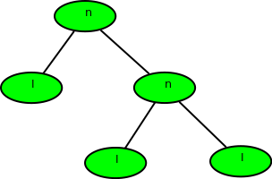
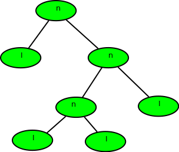

## 1. 问题描述

给定二叉树的前序遍历，计算其深度(或高度，从0开始)。前序以一个包含两个可能字符的字符串。

1. "l"表示叶节点
2. "n"表示内部节点

给定的树可以看作是一个满二叉树，其中每个节点都有0或两个子节点。节点的两个子节点可以是“n”或“l”，也可以是两者的混合。

示例：

```
输入：nlnll(如下图)
输出：2
```



```
输入：nlnnlll(如下图)
输出：3
```



## 2. 算法分析

给定二叉树的前序所以遍历

此外，我们得到一个char字符串(由“n”和“l”组成)，因此也不需要实现树。

递归函数为：

1. 基准条件：当tree[i] = ‘l’或者i >= strlen(tree); return 0
2. findDepth(tree[i++]) //左子树
3. findDepth(tree[i++]) //右子树

其中i是字符串树(给定的前缀遍历字符串)的索引。

## 3. 算法实现

```java
public class DepthFromPreOrder {

  public int findDepth(String tree, int n) {
    int index = 0;
    return findDepthRecursive(tree, n, index);
  }

  // 返回左子树和右子树高度的较大值
  private int findDepthRecursive(String tree, int n, int index) {
    if (index >= n || tree.charAt(index) == 'l')
      return 0;
    // 计算左子树的高度(在前序遍历中左子树在右子树之前处理)
    index++;
    int left = findDepthRecursive(tree, n, index);
    index++;
    // 计算右子树的高度
    int right = findDepthRecursive(tree, n, index);
    return Math.max(left, right) + 1;
  }
}
```

时间复杂度：O(n)

辅助空间：O(1)