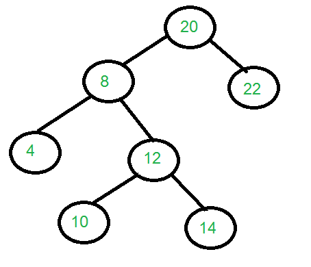

## 1. 问题描述

给定二叉树的中序和层序遍历，构造二叉树。



```
输入: 表示二叉树中序和层序遍历的两个数组
in[] = {4, 8, 10, 12, 14, 20, 22};
level[] = {20, 8, 22, 4, 12, 10, 14};

输出: 构造由两个数组表示的树。对于上述两个数组构建的树如所上图所示。
```

## 2. 算法分析

让我们考虑上面的例子。

```
in[] = {4, 8, 10, 12, 14, 20, 22};
level[] = {20, 8, 22, 4, 12, 10, 14};
```

在层序序列中，第一个元素是树的根节点。通过在前序序列搜索“20”，
我们可以发现“20”左侧的所有元素都在左子树中，右侧的元素都在右子树中。因此可以推出以下结构。

```
             20
           /    
          /       
 {4,8,10,12,14}  {22}
```

我们将{4,8,10,12,14}称为中序遍历中的左子数组，将{22}称为中序遍历中的右子数组。

在层序遍历中，左右子树的key是不连续的。因此，我们从层序遍历中提取位于中序遍历左子数组中所有节点。
为了构造根节点的左子树，我们对从层序遍历中提取的元素和中序遍历的左子数组进行递归。在上面的示例中，我们重复以下两个数组。

```
// 重复以下数组以构造左子树
In[]    = {4, 8, 10, 12, 14}
level[] = {8, 4, 12, 10, 14}
```

类似地，我们重复以下两个数组并构造右子树。

```
In[]    = {22}
level[] = {22}
```

## 3. 算法实现

以下是上述方法的具体实现：

```java
public class ConstructTreeFromInLevelOrder {
  Node root;

  public Node buildTree(int[] in, int[] level) {
    return constructTree(null, level, in, 0, in.length - 1);
  }

  private Node constructTree(Node startNode, int[] levelOrder, int[] inOrder, int inStart, int inEnd) {
    if (inStart > inEnd)
      return null;
    if (inStart == inEnd)
      return new Node(inOrder[inStart]);
    boolean found = false;
    int index = 0;
    for (int i = 0; i < levelOrder.length - 1; i++) {
      int data = levelOrder[i];
      for (int j = inStart; j < inEnd; j++) {
        if (data == inOrder[j]) {
          startNode = new Node(data);
          found = true;
          index = j;
          break;
        }
      }
      if (found)
        break;
    }
    startNode.setLeft(constructTree(startNode, levelOrder, inOrder, inStart, index - 1));
    startNode.setRight(constructTree(startNode, levelOrder, inOrder, index + 1, inEnd));
    return startNode;
  }

  public void printInorder(Node node) {
    if (node == null)
      return;
    printInorder(node.left);
    System.out.print(node.data + " ");
    printInorder(node.right);
  }

  static class Node {
    int data;
    Node left, right;

    Node(int item) {
      data = item;
      left = right = null;
    }

    public void setLeft(Node left) {
      this.left = left;
    }

    public void setRight(Node right) {
      this.right = right;
    }
  }
}
```

上述方法的时间复杂度上限为O(n<sup>3</sup>)。在主递归函数中，构造一个根节点需要O(n<sup>2</sup>)个时间。

代码可以通过多种方式进行优化，可能会有更好的解决方案。

## 4. hash算法

下面的算法使用O(n<sup>2</sup>)时间复杂度来解决上述问题，使用Java中的HashSet来放置当前根节点的左子树的值，
然后确定当前levelOrder节点是否是左子树的一部分。

如果它是左子树的一部分，则为左子树添加一个lLevel数组，否则为右子树添加一个lLevel数组。