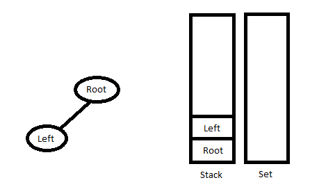
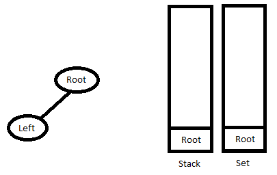
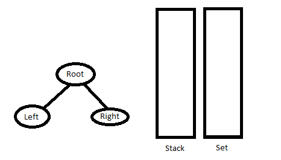

## 1. 算法分析

让我们考虑以下的二叉树遍历结果：

中序遍历: D B E A F C
前序遍历: A B D E C F

在前序字符串中，最左边的元素是树的根节点。所以我们知道‘A’是根节点。通过在中序遍历字符串搜索“A”，我们可以发现“A”左侧的所有元素都在左子树中，
右侧的元素在右子树中。如下所示。

```
        A
      /   
    /       
  D B E     F C
```

我们递归地按照上述步骤，得到下面的树。

```
        A
       /   
     /       
    B         C
   /         /
 /         /
D       E  F
```

```
算法：buildTree()
1. 从前序序列中选择一个元素。递增前序索引变量(下面代码中的preIndex)来选择下一个递归调用中的下一个元素。
2. 创建一个新的树节点tNode，并将第1步中选择的元素作为数据。
3. 在中序序列中找到所选取元素的索引。设索引为inIndex。
4. 为inIndex之前的元素递归调用buildTree()，并将构建的树作为tNode的左子树。
5. 为inIndex之后的元素递归调用buildTree()，并将构建的树作为tNode的右子树。
6. 返回tNode。
```

## 2. 算法实现

以下为具体的实现：

```java
public class ConstructTreeFromPreInOrder {
  Node root;
  static int preIndex = 0;

  / 
     从中序序列in[]和前序序列pre[]构造大小为len的二叉树的递归方法。
     inStart和inEnd的初始值应为0和len-1。
     对于中序和前序不形成树的情况，该方法不会进行任何错误检查。
  /
  public Node buildTree(char[] in, char[] pre, int inStart, int inEnd) {
    if (inStart > inEnd)
      return null;
    // 使用preIndex从前序遍历中选择当前节点并自增preIndex
    Node tNode = new Node(pre[preIndex++]);
    // 如果此节点没有子节点，则返回
    if (inStart == inEnd)
      return tNode;
    // 否则在中序遍历中查找此节点的索引
    int inIndex = search(in, inStart, inEnd, tNode.data);
    // 在中序遍历中使用inIndex，构造左右子树
    tNode.left = buildTree(in, pre, inStart, inIndex - 1);
    tNode.right = buildTree(in, pre, inIndex + 1, inEnd);
    return tNode;
  }

  public int search(char[] arr, int start, int end, char value) {
    int i;
    for (i = start; i <= end; i++) {
      if (arr[i] == value)
        return i;
    }
    return i;
  }

  public void printInorder(Node root) {
    if (root == null)
      return;
    printInorder(root.left);
    System.out.print(root.data + " ");
    printInorder(root.right);
  }

  static class Node {
    char data;
    Node left, right;

    Node(char item) {
      data = item;
      left = right = null;
    }
  }
}
```

时间复杂度：O(n<sup>2</sup>)，最坏的情况发生在树向左倾斜时。最坏情况下的前序和中序遍历示例为{A，B，C，D}和{D，C，B，A}。

我们可以使用哈希(Java中的HashMap)优化上述解决方案。我们将中序遍历的索引存储在HashMap中。这样搜索就可以一次性完成。

```java
public class ConstructTreeFromPreInOrder {
  Node root;
  static int preIndex = 0;
  static HashMap<Character, Integer> mp = new HashMap<>();

  public Node buildTreeUsingHashWrap(char[] in, char[] pre, int len) {
    for (int i = 0; i < len; i++)
      mp.put(in[i], i);
    return buildTreeUsingHash(in, pre, 0, len - 1);
  }

  private Node buildTreeUsingHash(char[] in, char[] pre, int inStart, int inEnd) {
    if (inStart > inEnd)
      return null;
    char current = pre[preIndex++];
    Node tNode = new Node(current);
    if (inStart == inEnd)
      return tNode;
    Integer inIndex = mp.get(current);
    tNode.left = buildTreeUsingHash(in, pre, inStart, inIndex - 1);
    tNode.right = buildTreeUsingHash(in, pre, inIndex + 1, inEnd);
    return tNode;
  }

  public void printInorder(Node root) {
    if (root == null)
      return;
    printInorder(root.left);
    System.out.print(root.data + " ");
    printInorder(root.right);
  }

  static class Node {
    char data;
    Node left, right;

    Node(char item) {
      data = item;
      left = right = null;
    }
  }
}
```

时间复杂度：O(n)

## 3. 其他方法

根据中序遍历是Left-Root-Right而前序遍历是Root-Left-Right。
此外，前序遍历中的第一个节点始终是根节点，而中序遍历中的第一个节点是树中最左边的节点。
维护两个数据结构：Stack(存储我们在遍历前序序列数组时访问的路径)和Set(维护预期包含下一个右子树的节点)。

```
1. 执行以下操作，直到到达最左侧的节点。
从前序序列创建节点，如果栈的最顶层元素不在集合中，将创建的节点链接到堆栈最顶层元素(如果有)的左子节点，不弹出元素。
否则，将创建的节点链接到栈最顶层元素的右子节点。
从集合和栈中移除栈的最顶层元素，将节点push到栈中。
```



```
2. 不断从栈中弹出节点，直到栈为空，或者栈的最顶部元素与中序遍历的当前元素相比较。
循环结束后，将最后一个节点push回栈和集合中。
```



```
3. 转到步骤1
```



以下为该方法的具体实现：

