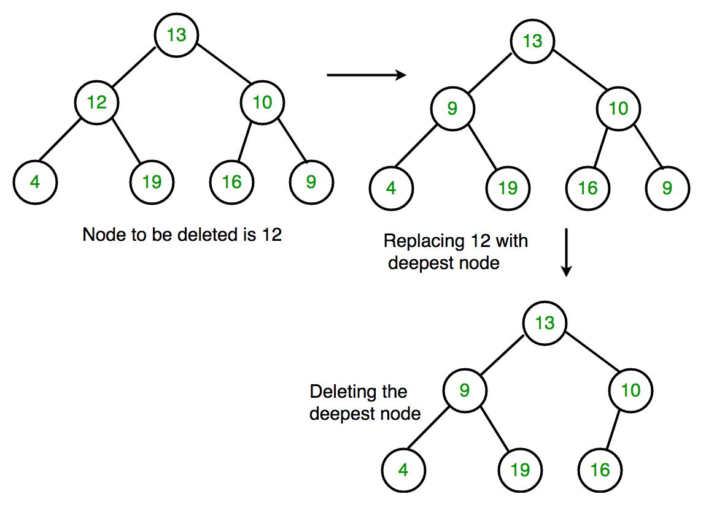

## 1. 问题描述

给定一棵二叉树，通过确保树从底部收缩来从中删除一个节点(即，删除的节点被最底部和最右边的节点替换)。
这与BST删除不同。这里我们没有任何元素之间的顺序，所以我们用最后一个元素替换它们。

示例：

```
删除下面树中的10

       10
     /             
    20     30
输出:    
      30
     /             
   20     

删除下面树中的20
       10
     /             
    20     30
             
             40
输出:    
       10
                      
          30
           
            40   
```

## 2. 算法分析

1. 从根节点开始，找到二叉树中最深、最右的节点以及要删除的节点。
2. 用最深最右边节点的数据替换要删除的节点数据。
3. 然后删除最右边最深的节点。



## 3. 算法实现

以下是上述方法的具体实现：

```java
public class BinaryTreeDelete {
    BinaryTree tree;
    Node root;

    public BinaryTreeDelete(BinaryTree tree) {
        this.tree = tree;
        root = tree.root;
    }

    public void deleteNode(Node root, int key) {
        if (root == null)
            return;
        if (root.left == null && root.right == null) {
            if (root.key == key)
                root = null;
            return;
        }
        Queue<Node> queue = new LinkedList<>();
        queue.add(root);
        Node temp = null;
        Node keyNode = null;
        while (!queue.isEmpty()) {
            temp = queue.peek();
            queue.remove();
            if (temp.key == key)
                keyNode = temp;
            if (temp.left != null)
                queue.add(temp.left);
            if (temp.right != null)
                queue.add(temp.right);
        }
        if (keyNode != null) {
            int x = temp.key;
            deleteDeepest(root, temp);
            keyNode.key = x;
        }
    }

    private void deleteDeepest(Node root, Node deletedNode) {
        Queue<Node> queue = new LinkedList<>();
        queue.add(root);
        Node temp;
        while (!queue.isEmpty()) {
            temp = queue.peek();
            queue.remove();
            if (temp == deletedNode) {
                temp = null;
                break;
            }
            if (temp.right != null) {
                if (temp.right == deletedNode) {
                    temp.right = null;
                    return;
                } else
                    queue.add(temp.right);
            }
            if (temp.left != null) {
                if (temp.left == deletedNode) {
                    temp.left = null;
                    return;
                } else
                    queue.add(temp.left);
            }
        }
    }

    public void inOrder(Node root) {
        if (root == null)
            return;
        inOrder(root.left);
        System.out.print(root.key + " ");
        inOrder(root.right);
    }
}
```

注意：

我们还可以将要删除的节点数据替换为其左右子节点均指向null的任何节点，但我们仅使用最深节点来保持二叉树的平衡。

如果要删除的节点是最深的节点本身，则上面的代码将不起作用，因为在函数deleteDeepest(root, temp)执行完成后，
keyNode被删除(因为这里keyNode等于temp)，然后替换keyNode的具有最深节点数据(temp的数据)的数据会引发运行时错误。

为了避免上述错误，也为了避免两次执行BFS(第一次迭代时搜索最右边最深的节点，第二次迭代时删除最右边最深的节点)，
我们可以在第一次遍历时存储被删除节点的父节点，并且在将需要删除的节点的数据设置为最右边的最深节点的数据后，轻松删除最右边的最深节点。

```java
public class BinaryTreeDelete {
    Node root;

    public BinaryTreeDelete(Node root) {
        this.root = root;
    }

    public Node deleteNode(Node root, int key) {
        if (root == null)
            return null;
        if (root.left == null && root.right == null) {
            if (root.key == key)
                return null;
            return root;
        }
        Queue<Node> queue = new LinkedList<>();
        queue.add(root);
        Node keyNode = null;
        Node temp = null;
        Node last = null;
        while (!queue.isEmpty()) {
            temp = queue.peek();
            queue.remove();
            if (temp.key == key)
                keyNode = temp;
            if (temp.left != null) {
                last = temp;
                queue.add(temp.left);
            }
            if (temp.right != null) {
                last = temp;
                queue.add(temp.right);
            }
        }
        if (keyNode != null) {
            int x = temp.key;
            if (last.right == temp)
                last.right = null;
            else
                last.left = null;
            keyNode.key = x;
        }
        return root;
    }

    public void inOrder(Node root) {
        if (root == null)
            return;
        inOrder(root.left);
        System.out.print(root.key + " ");
        inOrder(root.right);
    }
}

class BinaryTreeDeleteUnitTest {

    @Test
    void givenBT_whenDeleteNode_thenCorrect() {
        BinaryTreeDelete tree = createBT();
        tree.inOrder(tree.root);
        tree.deleteNode(tree.root, 11);
        System.out.println();
        tree.inOrder(tree.root);
    }

    public BinaryTreeDelete createBT() {
        Node root = new Node(10);
        root.left = new Node(11);
        root.left.left = new Node(7);
        root.left.right = new Node(12);
        root.right = new Node(9);
        root.right.left = new Node(15);
        root.right.right = new Node(8);
        return new BinaryTreeDelete(root);
    }
}
```