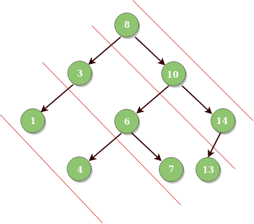

## 1. 问题描述

考虑节点之间通过的坡度为1的直线。给定一棵二叉树，打印二叉树中属于同一行的所有对角线元素。

```
输入：以下树的根节点
```



```
输出： 
二叉树的对角遍历：
 8 10 14
 3 6 7 13
 1 4
Observation：root和root.right的值将优先于所有root.left的值。
```

## 2. 算法实现

这个想法是使用map。我们使用不同的坡度距离并将它们用作map中的key。map中的value是节点的向量(或动态数组)。我们遍历树以将值存储在map中。
一旦map建立，我们打印它的内容。

以下是上述想法的具体实现：

```java
public class DiagonalTraversal {
  Node root;

  public DiagonalTraversal(Node root) {
    this.root = root;
  }

  public void diagonalPrintUsingMap(Node root) {
    TreeMap<Integer, Vector<Integer>> diagonalPrint = new TreeMap<>();
    diagonalPrintUsingMapUtil(root, 0, diagonalPrint);
    for (Map.Entry<Integer, Vector<Integer>> entry : diagonalPrint.entrySet())
      System.out.println(entry.getValue());
  }

  private void diagonalPrintUsingMapUtil(Node root, int d, TreeMap<Integer, Vector<Integer>> diagonalPrint) {
    if (root == null)
      return;
    // 获取特定d值处的列表
    Vector<Integer> k = diagonalPrint.get(d);
    // 如果k为null，创建向量并存储数据
    if (k == null) {
      k = new Vector<>();
      k.add(root.key);
      // k不为null，更新列表
    } else
      k.add(root.key);
    diagonalPrint.put(d, k);
    // 如果访问左子节点自增垂直距离
    diagonalPrintUsingMapUtil(root.left, d + 1, diagonalPrint);
    // 如果访问右子节点垂直距离相同
    diagonalPrintUsingMapUtil(root.right, d, diagonalPrint);
  }
}
```

该解的时间复杂度为O(nlogn)，空间复杂度为O(n)。

## 3. 使用队列

每个节点都将有助于生成下一个对角线。只有当它的左子节点可用时，我们才会将元素添加到队列中。我们将处理节点并向右移动。

