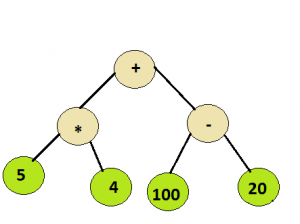
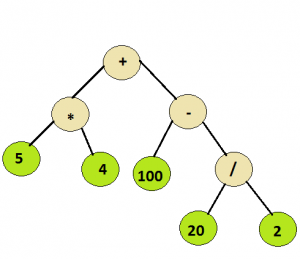

## 1. 问题描述

给定一个简单的表达式树，由基本的二元运算符组成，即+ 、– 、 和 / 以及一些整数，计算表达式树。

示例：

```
输入：以下树的根节点
输出：100
```



```
输入：以下树的根节点
输出：110
```



## 2. 算法分析

解决此问题的方法基于以下分析：

由于树中的所有运算符都是二元的，因此每个节点将有0或2个子节点。从上面的例子可以推断，
所有的整数值都会出现在叶子节点上，而内部节点代表运算符。

因此，我们可以按中序遍历二叉树，并计算表达式。

为了计算语法树，可以采用递归方法。

```
设t为语法树
if t不为null，则
   if t.data是操作数，则
      return t.data
   else // t.data为运算符
      A = solve(t.left)
      B = solve(t.right)
      return A operator B，其中operator是t中包含的运算符
```

## 3. 算法实现

以下是上述方法的具体实现：

```java
public class EvaluationExpressionTree {

  public int toInt(String s) {
    return Integer.parseInt(s);
  }

  public int evalTree(Node root) {
    // 如果树为空，返回0
    if (root == null)
      return 0;
    // 如果树只有一个节点，返回根节点的值
    if (root.left == null && root.right == null)
      return toInt(root.data);
    // 计算左子树
    int leftEval = evalTree(root.left);
    // 计算右子树
    int rightEval = evalTree(root.right);
    // 将当前父节点的操作符应用于左右子树返回的操作数
    if (root.data.equals("+"))
      return leftEval + rightEval;
    if (root.data.equals("-"))
      return leftEval - rightEval;
    if (root.data.equals(""))
      return leftEval  rightEval;
    return leftEval / rightEval;
  }

  static class Node {
    String data;
    Node left;
    Node right;

    public Node(String data) {
      this.data = data;
      left = null;
      right = null;
    }
  }
}

class EvaluationExpressionTreeUnitTest {

  @Test
  @DisplayName("givenExpressionTree_whenEvalExpression_thenShouldSuccess")
  void givenExpressionTree_whenEvalExpression_thenShouldSuccess() {
    EvaluationExpressionTree tree = new EvaluationExpressionTree();
    Node root = new Node("+");
    root.left = new Node("");
    root.left.left = new Node("5");
    root.left.right = new Node("-4");
    root.right = new Node("-");
    root.right.left = new Node("100");
    root.right.right = new Node("20");
    assertEquals(60, tree.evalTree(root));

    root = new Node("+");
    root.left = new Node("");
    root.left.left = new Node("5");
    root.left.right = new Node("4");
    root.right = new Node("-");
    root.right.left = new Node("100");
    root.right.right = new Node("/");
    root.right.right.left = new Node("20");
    root.right.right.right = new Node("2");
    assertEquals(110, tree.evalTree(root));
  }
}
```

时间复杂度：O(n)，因为每个节点访问一次。

辅助空间：O(1)