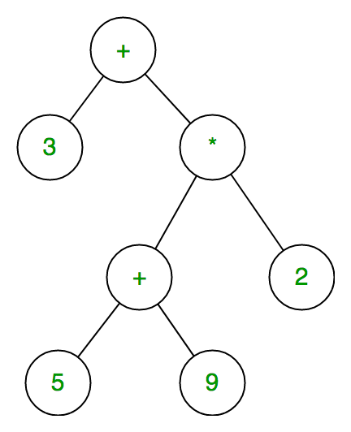
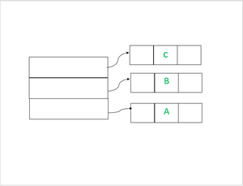
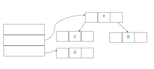

## 1. 问题描述

表达式树是一个二叉树，其中每个内部节点对应于运算符，每个叶节点对应于操作数，因此，例如3 + ((5 + 9)  2)的表达式树为：



表达式树的中序遍历产生给定后缀表达式的中缀版本(与后序遍历相同，它给出后缀表达式)

## 2. 算法分析

计算表达式树表示的表达式：

```
设t为表达式树
if t不为null then
   if t.value是操作数，
      则返回t.value
   A = solve(t.left)
   B = solve(t.right)
   
   // 计算在A和B上应用运算符“t.value”，并返回值
   return calculate(A, B, t.value)
```

表达式树的构造：

为了构建表达式树，我们使用栈。我们遍历输入表达式并对每个字符执行以下操作。

1. 如果字符是操作数，则将其压入栈
2. 如果字符是运算符，则从栈中弹出两个值(操作数)，使其成为子节点，并再次push当前节点。

最后，栈的唯一元素将是表达式树的根。

示例：

```
输入:  A B C+ D/
输出: A + B  C / D
```

前三个符号是操作数，因此创建树节点并将指向它们的指针压入栈，如下所示。



在下一步中，将读取一个运算符“”，因此弹出两个指向树的指针，形成一棵新树并将指向它的指针压入栈。



在下一步中，将读取一个运算符“+”，因此弹出两个指向树的指针，形成一棵新树并将指向它的指针压入栈。

类似地，如上所述，我们首先将“D”压入栈，然后在最后一步中，首先读取“/”，然后在上一步中，最顶层的元素将弹出，
然后是根“/”的右子树，其他节点将是右子树。

## 3. 具体实现

以下是上述方法的具体实现：

```java
public class ExpressionTree {
  Node root;

  private boolean isOperator(char ch) {
    return (ch == '+' || ch == '-' || ch == '' || ch == '/');
  }

  public Node expressionTree(String expression) {
    Stack<Node> stack = new Stack<>();
    Node t1, t2, temp;
    for (int i = 0; i < expression.length(); i++) {
      if (!isOperator(expression.charAt(i))) {
        temp = new Node(expression.charAt(i));
        stack.push(temp);
      } else {
        t1 = stack.pop();
        t2 = stack.pop();
        temp = new Node(expression.charAt(i));
        temp.left = t2;
        temp.right = t1;
        stack.push(temp);
      }
    }
    temp = stack.pop();
    return temp;
  }

  public void inOrder(Node root) {
    if (root == null)
      return;
    inOrder(root.left);
    System.out.print((char) root.key);
    inOrder(root.right);
  }
}

class ExpressionTreeUnitTest {

  @Test
  @DisplayName("givenExpressionTree_whenPrintExpression_thenCorrect")
  void givenExpressionTree_whenPrintExpression_thenCorrect() {
    ExpressionTree tree = new ExpressionTree();
    Node root = tree.expressionTree("ABC+D/");
    tree.inOrder(root);
  }
}
```