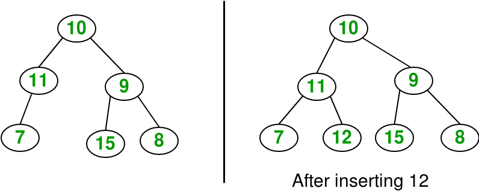

## 1. 问题描述

给定一个二叉树和一个key，将key按层序遍历顺序插入到二叉树的第一个可用位置。



## 2. 算法分析

其思想是使用队列对给定的树进行层序遍历。如果我们找到一个左子节点为空的节点，我们将新的key作为该节点的左子节点。
否则，如果我们找到一个节点的右子节点为空，则将新key设为右子节点。我们一直遍历树，直到找到一个左或右子节点为空的节点。

```java
public class InsertInOrder {
    BinaryTree tree;
    Node root;

    public InsertInOrder(BinaryTree tree) {
        this.tree = tree;
        root = tree.root;
    }

    // 中序遍历
    public void inOrder(Node temp) {
        if (temp == null)
            return;
        inOrder(temp.left);
        System.out.print(temp.key + " ");
        inOrder(temp.right);
    }

    public void insert(Node temp, int key) {
        if (temp == null) {
            temp = new Node(key);
            return;
        }
        Queue<Node> queue = new LinkedList<>();
        queue.add(temp);
        // 遍历，直到找到一个节点的左子节点或者右子节点为null
        while (!queue.isEmpty()) {
            temp = queue.peek();
            queue.remove();
            if (temp.left == null) {
                temp.left = new Node(key);
                return;
            } else
                queue.add(temp.left);
            if (temp.right == null) {
                temp.right = new Node(key);
                break;
            } else
                queue.add(temp.right);
        }
    }
}
```

时间复杂度：O(V)，其中V是节点数。

辅助空间：O(B)，其中B是树的宽度，在最坏的情况下，我们需要保存队列中某一层的所有顶点。