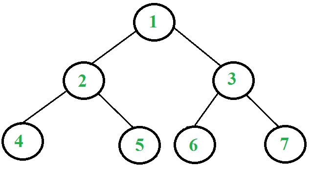

## 1. 算法分析

我们已经讨论了[迭代中序](InOrderTreeTraversal_WithoutRecursion.md)和[迭代前序](Iterative_PreorderTraversal.md)遍历。
在这篇文章中，介绍迭代后序遍历，它比其他两个遍历更复杂(由于其非尾递归的性质，在最终递归调用自身之后有一个额外的语句)。
不过，使用两个栈可以轻松完成后序遍历。其思想是是将反向后序遍历push到栈中。一旦我们在栈中进行了反向后序遍历，
我们就可以从栈中一个一个地弹出所有节点并打印它们；由于堆栈的LIFO属性，此打印顺序将为后序。
现在的问题是，如何在栈中获取反转的后序元素——第二个栈用于此目的。例如，在下面的树中，
我们需要在栈中获取1、3、7、6、2、5、4。如果仔细观察这个序列，我们可以观察到这个序列与前序遍历非常相似。
唯一的区别是右孩子在左孩子之前被访问，因此顺序是“root right left”而不是“root left right”。
所以，我们可以做一些类似迭代前序遍历的事情，但有以下区别：

1. 我们不打印节点，而是将其push到栈中。
2. 我们在右子树之前push左子树。

下面是完整的算法。在步骤2之后，我们得到了第二个栈中的后序遍历的相反结果。我们使用第一个栈来获得正确的顺序。

```
1. 将根节点push到第一个栈。
2. 第一个栈不为空时循环
   2.1 从第一个栈中弹出一个节点并将其push到第二个栈
   2.2 将弹出节点的左右子节点push到第一个栈
3. 打印第二个栈的内容
```

让我们考虑以下树：



以下是使用两个栈打印上述树的后序遍历的步骤。

```
1. Push 1到第一个栈.
      First stack: 1
      Second stack: Empty

2. 从第一个栈中弹出1并将其push到第二个栈. 
   将1的左右子节点push到第一个栈
      First stack: 2, 3
      Second stack: 1

3. 从第一个栈中弹出3并将其push到第二个栈. 
   将3的左右子节点push到第一个栈
      First stack: 2, 6, 7
      Second stack: 1, 3

4. 从第一个栈中弹出7并将其push到第二个栈.
      First stack: 2, 6
      Second stack: 1, 3, 7

5. 从第一个栈中弹出6并将其push到第二个栈.
      First stack: 2
      Second stack: 1, 3, 7, 6

6. 从第一个栈中弹出2并将其push到第二个栈. 
   将2的左右子节点push到第一个栈
      First stack: 4, 5
      Second stack: 1, 3, 7, 6, 2

7. 从第一个栈中弹出5并将其push到第二个栈.
      First stack: 4
      Second stack: 1, 3, 7, 6, 2, 5

8. 从第一个栈中弹出4并将其push到第二个栈.
      First stack: Empty
      Second stack: 1, 3, 7, 6, 2, 5, 4

算法在这里停止，因为第一个栈中没有更多的节点。观察第二个栈的内容是后序方式。打印它们。
```

## 2. 算法实现

下面是使用两个栈实现迭代后序遍历的具体实现：

```java
public class PostOrderTraversal {
  Node root;

  public PostOrderTraversal(Node root) {
    this.root = root;
  }

  public void postOrderIterativeUsingTwoStack(Node root) {
    if (root == null)
      return;
    Stack<Node> stack1 = new Stack<>();
    Stack<Node> stack2 = new Stack<>();
    // 将根节点push到stack1中
    stack1.push(root);
    // 循环直到stack1为空
    while (!stack1.isEmpty()) {
      // 从stack1中弹出一个节点并push到stack2中
      Node temp = stack1.pop();
      stack2.push(temp);
      // 将弹出节点的左右子节点push到stack1中
      if (temp.left != null)
        stack1.push(temp.left);
      if (temp.right != null)
        stack1.push(temp.right);
    }
    // 最终打印stack2中所有元素
    while (!stack2.isEmpty()) {
      Node temp = stack2.pop();
      System.out.print(temp.key + " ");
    }
  }
}

class PostOrderTraversalUnitTest {

  @Test
  @DisplayName("givenBinaryTree_whenPostTraversalUsingTwoStack_thenCorrect")
  void givenBinaryTree_whenPostTraversalUsingTwoStack_thenCorrect() {
    PostOrderTraversal tree = createTree();
    tree.postOrderIterativeUsingTwoStack(tree.root);
  }

  private PostOrderTraversal createTree() {
    Node root = new Node(1);
    root.left = new Node(2);
    root.right = new Node(3);
    root.left.left = new Node(4);
    root.left.right = new Node(5);
    root.right.left = new Node(6);
    root.right.right = new Node(7);
    return new PostOrderTraversal(root);
  }
}
```