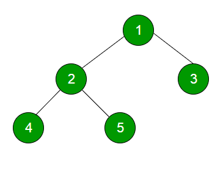

## 1. 问题描述

树的层序遍历是树的广度优先遍历。



上述树的层序遍历为1 2 3 4 5

## 2. 方法一(使用函数打印当前层)

这种方法基本上有两个函数。一种是打印给定级别的所有节点(printCurrentLevel)，另一种是打印树的层序遍历(printLevelorder)。
printLevelorder利用printCurrentLevel从根节点开始，逐层打印所有层级的节点。

```
/打印树的层序遍历的函数/
printLevelorder(tree)
for d = 1 to height(tree)
  printCurrentLevel(tree, d);

/打印当前层的所有节点的函数/
printCurrentLevel(tree, level)
if tree为null，直接返回;
if level为1, then
   print(tree.data);
else if level大于1, then
   printCurrentLevel(tree.left, level-1);
   printCurrentLevel(tree.right, level-1);
```

以下为该方法的具体实现：

```java
public class LevelOrderTraversal {
  Node root;

  LevelOrderTraversal(Node root) {
    this.root = root;
  }

  public void printLevelOrder(Node root) {
    int h = height(root);
    for (int i = 1; i <= h; i++)
      printCurrentLevel(root, i);
  }

  private void printCurrentLevel(Node root, int level) {
    if (level == 0)
      return;
    if (level == 1) {
      System.out.print(root.key + " ");
    } else if (level > 1) {
      if (root.left != null)
        printCurrentLevel(root.left, level - 1);
      if (root.right != null)
        printCurrentLevel(root.right, level - 1);
    }
  }

  private int height(Node root) {
    if (root == null)
      return 0;
    else {
      int lHeight = height(root.left);
      int rHeight = height(root.right);
      return lHeight > rHeight ? lHeight + 1 : rHeight + 1;
    }
  }
}
```

时间复杂度：最坏情况下为O(n<sup>2</sup>)。对于倾斜树，printCurrentLevel()需要O(n) 时间，其中n是倾斜树中的节点数。
所以printLevelOrder()的时间复杂度是O(n) + O(n-1) + O(n-2) + .. + O(1)，即O(n<sup>2</sup>)。

辅助空间：最坏情况下为O(n)。对于倾斜树，printCurrentLevel()使用O(n)空间作为调用栈。
对于平衡树，调用堆栈使用O(logn)空间，(即平衡树的高度)。

## 3. 方法二(使用队列)

对于每个节点，首先访问该节点，然后将其子节点放入队列。

```
printLevelorder(tree)
1) 创建一个空的队列q
2) temp_node = root /从根节点开始/
3) while temp_node != null
    a) 打印temp_node.data
    b) 将temp_node的子节点(先左后右子节点)添加到队列。
    c) 从q中取出一个节点。
```

下面是上述算法的一个简单实现。队列使用最大大小为500的数组实现。我们还可以将队列实现为链表。

```java
public class LevelOrderTraversal {
  Node root;

  LevelOrderTraversal(Node root) {
    this.root = root;
  }

  public void printLevelOrderUsingQueue(Node root) {
    Queue<Node> nodes = new LinkedList<>();
    nodes.add(root);
    Node temp;
    while (!nodes.isEmpty()) {
      temp = nodes.peek();
      nodes.remove();
      System.out.print(temp.key + " ");
      if (temp.left != null)
        nodes.add(temp.left);
      if (temp.right != null)
        nodes.add(temp.right);
    }
  }
}
```

时间复杂度：O(n)，其中n是二叉树中的节点数。

辅助空间：O(n)，其中n是二叉树中的节点数。