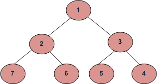

## 1. 问题描述

编写一个函数来打印树的螺旋顺序遍历。对于下树，函数应打印1、2、3、4、5、6、7。



## 2. 方法一(递归)

这个问题可以看成是[二叉树的层序遍历](LevelOrderTraversal_BinaryTree.md)的扩展。
要以螺旋顺序打印节点，应以交替顺序打印不同层级的节点。使用一个额外的布尔变量ltr用于更改层级的打印顺序。
如果ltr为1，则printGivenLevel()从左到右打印节点，否则从右到左打印节点。ltr的值在每次迭代中变换以更改顺序。

打印树的层序顺序遍历的函数：

```
printSpiral(tree)
  boolean ltr = 0;
  for d = 1 to height(tree)
     printGivenLevel(tree, d, ltr);
     ltr = !ltr /变换ltr/
```

用于在给定层级打印所有节点的函数：

```
printGivenLevel(tree, level, ltr)
if tree为null，直接return;
if level为1, then
    print(tree.data);
else if level大于1, then
    if(ltr)
        printGivenLevel(tree.left, level-1, ltr);
        printGivenLevel(tree.right, level-1, ltr);
    else
        printGivenLevel(tree.right, level-1, ltr);
        printGivenLevel(tree.left, level-1, ltr);
```

下面是上述算法的实现：

```java
public class LevelOrderSpiral {
  Node root;

  public LevelOrderSpiral(Node root) {
    this.root = root;
  }

  public void printSpiralUsingRecursive(Node node) {
    int heigth = heigth(node);
    boolean ltr = false;
    for (int i = 1; i <= heigth; i++) {
      printGivenLevel(node, i, ltr);
      ltr = !ltr;
    }
  }

  private void printGivenLevel(Node node, int level, boolean ltr) {
    if (node == null)
      return;
    if (level == 1)
      System.out.print(node.key + " ");
    else if (level > 1) {
      if (!ltr) {
        if (node.left != null)
          printGivenLevel(node.right, level - 1, ltr);
        if (node.right != null)
          printGivenLevel(node.left, level - 1, ltr);
      } else {
        if (node.right != null)
          printGivenLevel(node.left, level - 1, ltr);
        if (node.left != null)
          printGivenLevel(node.right, level - 1, ltr);
      }
    }
  }

  public int heigth(Node root) {
    if (root == null)
      return 0;
    else {
      int lHeight = heigth(root.left);
      int rHeight = heigth(root.right);
      return lHeight > rHeight ? lHeight + 1 : rHeight + 1;
    }
  }
}
```

时间复杂度：上述方法最坏情况下的时间复杂度为O(n<sup>2</sup>)。最坏的情况发生在树倾斜时。

## 3. 方法二(迭代)

我们可以在O(n)时间和O(n)额外空间中打印螺旋顺序遍历。方法是使用两个栈。我们可以使用一个栈从左到右打印，另一个栈从右到左打印。
在每次迭代中，我们在其中一个栈中有一个层级的节点。我们打印节点，并将下一层级的节点push到另一个栈中。

```java
public class LevelOrderSpiral {
  Node root;

  public LevelOrderSpiral(Node root) {
    this.root = root;
  }

  public void printSpiralUsingIterative(Node node) {
    // 根节点为null，直接return
    if (node == null)
      return;
    // s1存储从左到右打印的层级的所有节点
    Stack<Node> s1 = new Stack<>();
    // s2存储从右到左打印的层级的所有节点
    Stack<Node> s2 = new Stack<>();
    // 将第一层(根节点)的节点push到s1中
    s1.push(node);
    // 当两个栈全为空时，循环退出
    while (!s1.empty() || !s2.empty()) {
      // 从s1打印当前层的所有节点，并将下一层的节点push到s2中
      while (!s1.isEmpty()) {
        Node temp = s1.peek();
        s1.pop();
        System.out.print(temp.key + " ");
        // 由于栈是先进后出的，因此这里的push顺序与下一层的打印顺序相反
        if (temp.right != null)
          s2.push(temp.right);
        if (temp.left != null) {
          s2.push(temp.left);
        }
      }
      // 从s2打印当前层的所有节点，并将下一层的节点push到s1中
      while (!s2.isEmpty()) {
        Node temp = s2.peek();
        s2.pop();
        System.out.print(temp.key + " ");
        if (temp.left != null)
          s1.push(temp.left);
        if (temp.right != null)
          s1.push(temp.right);
      }
    }
  }
}
```

## 4. 方法三(迭代，使用双端队列)

方法是使用双端队列。在从左到右打印时，我们可以从双端队列前面循环和打印元素，然后在后面插入它们的子节点(先插入左子节点，然后是右子节点)。
在从右到左打印时，我们可以从双端后面循环和打印元素，然后在双端队列的前面插入它们的子节点(先插入右子节点，然后是左子节点)。

```java
public class LevelOrderSpiral {
  Node root;

  public LevelOrderSpiral(Node root) {
    this.root = root;
  }

  public void printSpiralUsingDeque(Node root) {
    Deque<Node> deque = new ArrayDeque<>();
    // 将树的根节点插入deque
    deque.offer(root);
    // 在打印每一层节点后切换
    boolean reverse = true;
    while (!deque.isEmpty()) {
      // 在这里保存双端队列的大小，在后面的步骤中双端队列的大小会经常改变
      int n = deque.size();
      // 如果从左向右打印
      if (!reverse) {
        // 从左到右迭代
        for (int i = 0; i < n; i++) {
          // 从双端队列的后面插入子节点，由于下一次是从右到左打印，因此需要先添加左子节点，然后是右子节点
          if (deque.peekFirst().left != null)
            deque.offerLast(deque.peekFirst().left);
          if (deque.peekFirst().right != null)
            deque.offerLast(deque.peekFirst().right);
          // 打印当前的节点
          System.out.print(deque.pollFirst().key + " ");
        }
        // 切换reverse以进行下一层遍历
        reverse = true;
      } else {
        // 如果我们从右到左打印，以相反的顺序迭代双端队列，并从前面插入子节点
        while (n-- > 0) {
          // 将子节点插入到双端队列的前面，先添加右子节点
          if (deque.peekLast().right != null)
            deque.offerFirst(deque.peekLast().right);
          if (deque.peekLast().left != null)
            deque.offerFirst(deque.peekLast().left);
          // 打印当前的节点
          System.out.print(deque.pollLast().key + " ");
        }
        // 切换reverse以进行下一层遍历
        reverse = false;
      }
    }
  }
}
```

时间复杂度：O(n)

辅助空间：O(n)