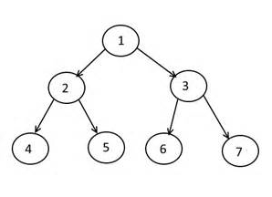
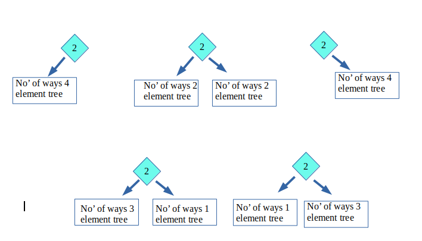

## 1. 问题描述

计算给定前序字符串长度n下可能的二叉树数。

示例：

```
输入: n = 1
输出: 1

输入: n = 2
输出: 2

输入: n = 3
输出: 5
```

## 2. 算法分析

在前序遍历中，我们首先处理根节点，然后遍历左子节点，然后遍历右子节点。

例如，下面树的前序遍历是1 2 4 5 3 6 7



查找具有给定前序遍历的树的个数：

如果给定这样的遍历长度(假设为n)，则可能的二叉树数。
让我们举个例子：给定前序遍历字符串 -> 2 4 6 8 10(长度5)。

+ 假设只有1个节点(在本例中为2)，因此只有1个二叉树是可能的。
+ 现在，假设有2个节点(即2和4)，那么只有2个二叉树是可能的。
+ 现在，当有3个节点(即2、4和6)时，可能的二叉树是5。
+ 考虑4个节点(即2、4、6和8)，所以可能的二叉树是14。假设BT(1)表示1个节点的二叉树数。(我们假设BT(0)=1)

  BT(4) = BT(0)  BT(3) + BT(1)  BT(2) + BT(2)  BT(1) + BT(3)  BT(0)
  BT(4) = 1  5 + 1  2 + 2  1 + 5  1 = 14
+ 同样，考虑所有5个节点(2、4、6、8和10)。二叉树的可能数为：

  BT(5) = BT(0)  BT(4) + BT(1)  BT(3) + BT(2)  BT(2) + BT(3)  BT(1) + BT(4)  BT(0)
  BT(5) = 1  14 + 1  5 + 2  2 + 5  1 + 14  1 = 42



因此，长度为5的前序遍历字符串的总二叉树是42。

我们使用动态规划来计算二叉树的可能数。我们一次取一个节点，并使用先前计算的树计算可能的树。

